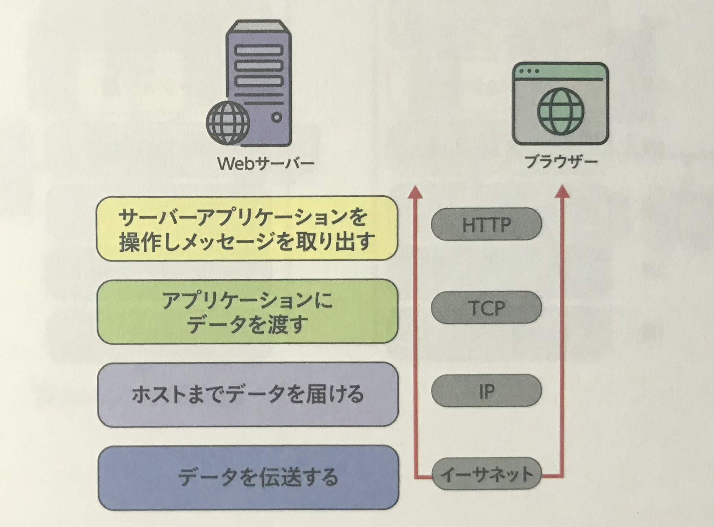
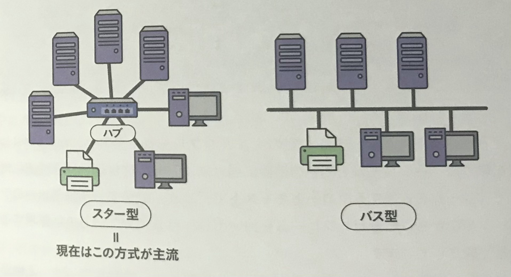
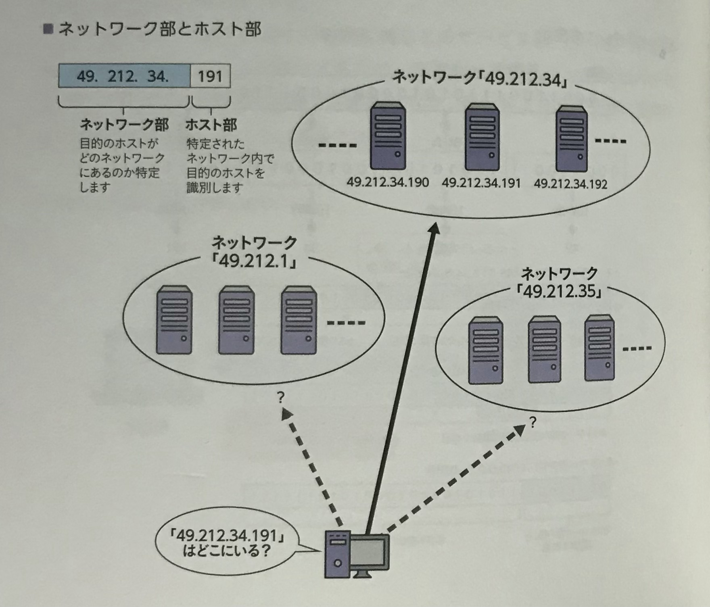
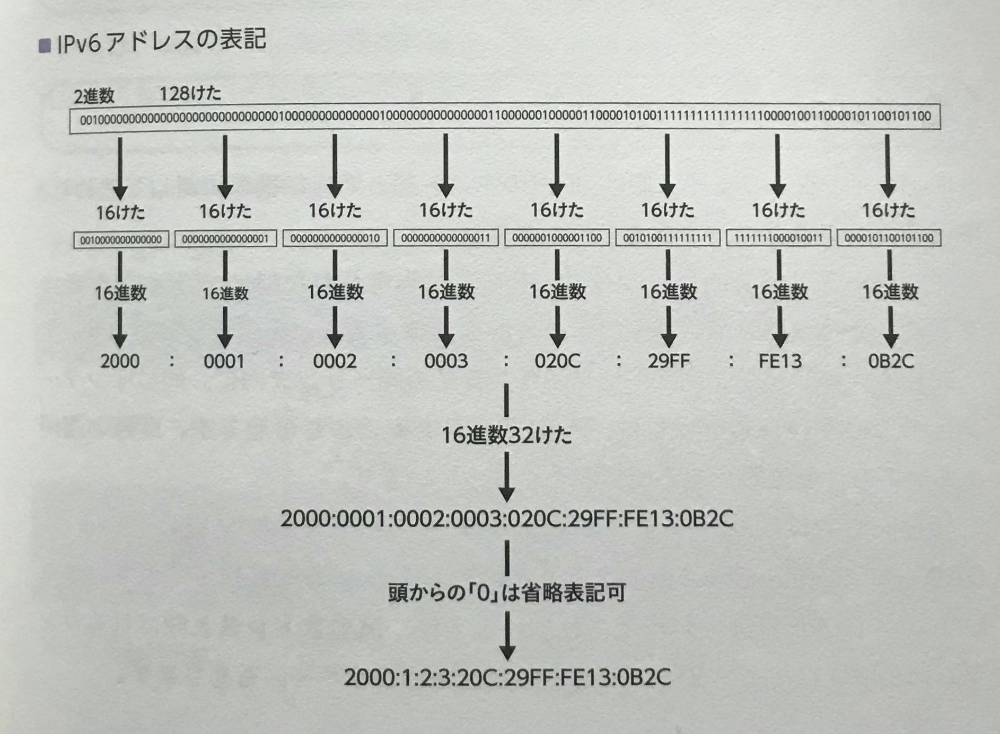

 

## 🟪 プロトコルの意味
元々は「**手順**」という意味があり、さまざまな場面で利用される。  
たとえば **「運用プロトコル」は運用手順をまとめたもので、「感染防止プロトコル」は感染予防策をまとめたもの**。  

 
 
 

## 🟪 ネットワーク通信の階層化
例えば、**手紙を書く上で必要なのは「手紙を書く能力」であり、「どうやって手紙を配達するか」について知る必要はない**。  
反対に、**配達員は「どうやって手紙を配達するか」を知っていればいいので、「手紙を書く能力」を持ち合わせる必要はない。**

ネットワークにおいてもそれは同様で、**それぞれの階層でそれぞれの務めに専念しさえいれば**、ブラウザーはWebサーバーからデータを受信して、Webページを表示できる。

ただしそれには条件も存在しており、**情報を送る側と受け取る側双方に、同等の能力や手段が必要になってくる**。  
そのための事前のルール決めとして「**プロトコル（通信規約）**」が必要になってくる。  

 
 
 

## 🟪 プロトコルの標準化
たとえ非常に優れたプロトコルであっても、**自分のまわりだけしか知らない**という状態では意味がない。  
なので、**「何もしなければ秩序が取れないもの」に決まりごとを策定し、互換性や品質を確保して技術の普及を図る**、ということが必要で、それを「**標準化**」と呼ぶ。  

（日本国内における産業製品では、**JIS** という規格が取り決められている）

 
 
 

## 🟪 プロトコルの階層化
**ブラウザーがWebサーバーと通信を行い、データをダウンロードする**という一連の流れをプロトコルの階層構造で表現できる。  

まず、**Webサーバーのアプリケーションを操作してデータを読み取る際に使用されるのが「HTTP」**  
その**読み取ったデータをアプリケーションに渡すプロトコルとして「TCP」**  
**ブラウザーが入ったPCまでデータを届けるプロトコルとして「IP」**  
そして、**実際にデータを伝送するためのプロトコルとして「イーサーネット」** を使用してデータのやり取りを可能にする。  

 
 
 

## 🟪 イーサネット
**物理的に接続されたコンピュータ同士の通信を行うためのプロトコルを「イーサネット」と言い**、速度や媒体によって多数の規格が存在している。  
本来のイーサネットは、**通信速度10Mbps、最大伝送距離100m**のものを指すが、現在では**100Mbpsの速度に対応した「ファストイーサネット」**、**１Gbpsの速度に対応した「ギガビットイーサネット」** などが多く利用されている。  
また、イーサネットの接続形態には「**バス型**」と「**スター型**」がある。  

 
 
 

## 🟪 MACアドレス
イーサネットで通信を行うために必要となる **「イーサネットアダプター」** には、基本的に**世界に一つしかない固有のID番号**が割り振られており、その番号で機器を識別する。  
この**固有のID番号を「MACアドレス」と呼び**、48ビットで構成され、8ビットごとに表記される。  

 
 
 

## 🟪 IPの基本的な働き
IPは、**上位層のTCPと、下位層のイーサネットを取り持っている。**  
イーサネットは物理的なネットワークならではの制約が存在するため、そのための最適化をおこなっている。

 
 
 

## 🟪 ルーターとルーティングテーブル
送信元と送信先が同じLAN内にあれば、直接通信を行えるが、送信先が他のネットワークにある場合は、「**ルーター**」という機器を経由する。  
ルーターは「**ルーティングテーブル**」と呼ばれる経路情報によって、送信先がどのネットワークに接続されているかを知ることができる。  

 
 
 

## 🟪 デフォルトゲートウェイ
**送信先が自分のネットワーク内にない場合、「デフォルトゲートウェイ」と呼ばれるルーターに送られる**。  
これは外部のネットワークと繋がっており、未知のIPアドレス宛のパケットは全てここを通して送信される。  
**IPアドレスが一致するネットワークにたどり着くまで**、このデフォルトゲートウェイによるバケツリレーが続いていく。   

 
 
 

## 🟪 TCP
**上位層のアプリケーションプロトコルと、下位層のIPを取り持つプロトコルである「TCP」は**、送受信されるパケットに欠損がないかチェックし、あった場合はパケットの再送を行うなどの「**エラー訂正機能**」を備えている。  
これにより**データ転送の信頼性を高めることができる**。  

 
 
 

## 🟪 ポート番号
TCPでは、**どのアプリケーションに渡せばよいかを「ポート番号」を使って区別している**。  
ポート番号には「**0 ~ 65535**（16ビットの範囲）」の整数値が利用される。  

**ポート番号はアプリケーションによって決められていて**、たとえばWebシステムは**80番**（HTTP)や**443番**（HTTPS)を使用する。  
よく使用されるポート番号は「**0 ~ 1023**」の範囲であらかじめ予約されており、**これを「ウェノウンポート」と呼ぶ**。  

 
 
 

## 🟪 IPv4アドレスの表記
「**192.168.1.10**」のように**10真数で表現された4つの整数**で表記される。  
しかしネットワーク上では「**1100 0000 1010 1000 0000 0001 0000 1010**」のように**32ビットのビット列**で使われており、私たちが目にするのはそれを**10進数**に変換したものが表示されている。  

 
 
 

## 🟪 ネットワーク部とホスト部
**IPv4アドレスは2つに分けることができる**。  
ネットワーク部は、**同じネットワークであれば同じになる**のに対して、ホスト部は、**ネットワーク内の端末に付けられるものなので同一ネットワーク内で他と同じになることはない**。  
例えば「**192.168.1**」をネットワーク部とした場合、最後尾にホスト部を付け足して、「**192.168.1.0**」が**ネットワークアドレス**となる。  

 
 
 

## 🟪 特別なIPv4アドレス
#### ブロードキャストアドレス
**同一ネットワーク上の全てのホストに対し、同時かつ同じデータを送信する際に使用する**。  
表記としては、32ビットのIPアドレスのうち、ホスト部をすべて「**１**」としたアドレス（「**192.168.1.255**」）になる。  

#### ループバックアドレス
**ホスト内部のアプリケーション同士が通信する際に使用する**。  
アドレスには「**127.0.0.1**」を使うのが一般的だが、OSによってそれ以外の場合もある。  

 
 
 

## 🟪 プライベートIPアドレス
端末には、世界で唯一のIPアドレスを割り振る必要があるが、**家庭LANなどの閉鎖されたネットワークでは、自由にIPアドレスを割り振ることができる**。  
インターネット上で利用されるアドレスを「**グローバルIPアドレス**」。  
閉鎖されたネットワーク内で使うアドレスを「**プライベートIPアドレス**」と呼ぶ。  
**プライベートIPアドレスで使用可能なアドレスはあらかじめ決められている。**

#### 利用可能なプライベートIPアドレス
|IPアドレス|アドレスクラス|ホスト数|
|:-|:-|:-|
|10.0.0.0 ~ 10.255.255.255|クラスA|16,777,216個|
|172.16.0.0 ~ 172.31.255.255|クラスB|2,097,152個|
|192.168.0.0 ~ 192.168.255.255|クラスC|65,536個|

**家庭内LANではプライベートIPアドレスを使用するが、インターネットに接続できる**。  
これは「**NAT**」と呼ばれる技術を使って、**プライベートIPアドレスをグローバルIPアドレスに変換することによって**インターネットへの接続を実現している。  

 
 
 

## 🟪 IPv6アドレスの表記
**IPv4**では「**32ビットのビット列を8ビットごとで4つに区切って、10進数に変換**」していたのに対して、**IPv6**は「**128ビット**」のアドレス空間を使用する。  

 
 
 

## 🟪 IPv6の付加機能
|||
|:-|:-|
|**アドレス空間の拡張**|約340澗個のアドレスが利用可能|
|**アドレスの自動設定**|ルータから送信される情報をもとにホストの起動とともに自動設定される|
|**セキュリティの向上**|パケットの暗号化や認証技術により、IPアドレスの詐称やパケットの改ざんを防止する機能（**IPsec**）が必須となっている|
|**サービス品質の実現**|パケットの優先度が指定されており、ルータは優先度に応じてパケットを処理する|
|**ルータの負荷低減**|パケットを最適化し、エラー検出機能の簡略化、経路情報の削減でルータの負荷を軽減する|

 
 
 

## 🟪 IPv6アドレスの種類
#### ユニキャストアドレス
１対１の通信で利用されるアドレス。このアドレスを使用することで１つのインターフェイスを特定可能となる。  

#### エニーキャストアドレス
複数のインターフェースに割り当てられるアドレス。ここにパケットを送信すると、グループに属する1つのインターフェイスにだけパケットが到達し、それ以上は配送されない。  

#### マルチキャストアドレス
複数のインターフェイスと通信するためのアドレス。IPv6にはブロードキャストアドレスがないため、これを同様の用途として使用する。  

 
 
 

## 🟪 DNS
ブラウザーでWebページを閲覧する際もWebサーバーなどをIPアドレスで指定するべきだが、数字の羅列であるIPアドレスは人によって直感的ではない。  
**そこで一般的にはアドレス欄に「http://www.gihyo.jp/」 の様にドメイン名を指定する**。  
これで通信が可能なのは、**IPアドレスとホスト名を相互に変換する「DNS」というシステムがあるためである。**

 

