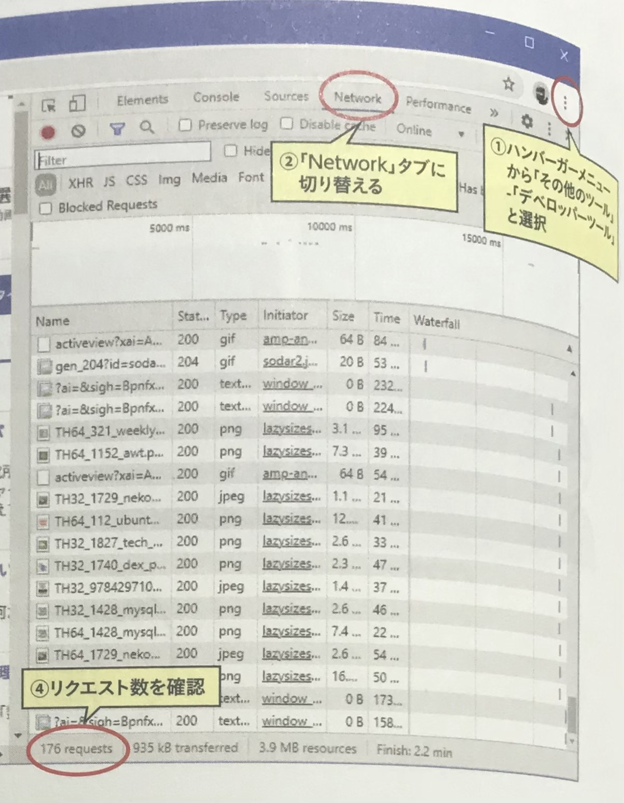

## 🟩 HTTPとは
HTTPは、**IPやTCPの上位層プロトコルにあたる「アプリケーションプロトコル」である**。  
処理やリソースをリクエストする「**Webクライアント**」と、要求に対してレスポンスを返す「**Webサーバー**」間の通信に利用される。  

<br>
<br>
<br>

## 🟩 HTTPリクエスト・HTTPレスポンス
**WebクライアントからWebサーバーに対して行われる要求を「HTTPリクエスト」と呼ぶ**。  
リクエストを受け取ったサーバーは、**応答として「HTTPレスポンス」を返す**。  


**1回のリクエストで取得できるリソースは1つであるため、クライアントが2つのリソースをダウンロードするには、2回リクエストを送信する必要がある**。  
また、リクエストとレスポンスは常に一対であり、**リクエストのみ、レスポンスのみ発生する**、ということはない。  

ホームページを表示するには、**HTMLテキストをはじめ、CSSファイルや画像ファイルなど複数のリソースが必要となるため**、**送信されるリクエストも複数回に及ぶ**。  



Webページを表示するために、**数百のパーツをWebサーバーからダウンロードする必要があるため、その分のリクエストが発生する**。  
現在ではデザイン性の高いWebページが増えており、Webサーバーの負荷は極めて高くなっている。  

<br>
<br>
<br>

## 🟩 クッキー（Cookie）
WebサーバーからWebブラウザーに送信される**極めて小さなデータである**。  
Webブラウザーはクッキーを保存しておき、**再度同じWebサーバーにリクエストを送信する際に、保存しておいたクッキーを一緒に送信する**。  

**クッキーが以前送ったものと同じかどうかを確認して**、同じものであれば以前アクセスしてきたWebブラウザーだと判断される。  
この仕組みによって、**会員制サイトのログイン状態を維持したり、ショッピングサイトでカートに入れた商品を保存できたりする**。  

そのほかにも、**ユーザーのアクセス履歴を取得して「トラッキング」やユーザー行動の分析といった用途にも使用されるため**、プライバシー保護の一環でクッキーの利用を制限している地域や国もある。  
（クッキーには有効期限が設定されており、その有効期限を過ぎると利用できなくなる)

<br>
<br>
<br>

## 🟩 HTTPメッセージの構造
HTTPリクエストもHTTPレスポンスも、**ともに「HTTPメッセージ」と呼ばれる形式のメッセージを使用する**。  
そのうち**リクエストで使用されるものを「リクエストメッセージ」**。  
**レスポンスで使用されるものを「レスポンスメッセージ」と呼ぶ**。  

HTTPメッセージには「**ASCll文字列**」を用いる。  
そのため、クライアント・サーバー間で行われる通信を手動で再現したり、**メッセージを見ればやりとりの内容を理解することも可能**。  

<br>
<br>
<br>

## 🟩 リクエストしてみる
リクエストとレスポンスの実現には、**teletコマンド**を用い、サービスポート番号には**80番**を指定する。  

```
$ telnet サーバーのアドレス サービスポート番号
```


<br>
<br>
<br>

## 🟩 リクエストメッセージの構造
リクエストメッセージは１行目が**リクエストライン**、２行目から空行までが**ヘッダー**、空行の次の行から末尾までが**ボディ**として構成されている。  


<br>

#### ● リクエストライン


<br>

#### ● メソッド
メソッドには、**サーバー上のHTMLファイルや画像ファイルなどのリソースに対する処理内容**を指定する。  

コンテンツの書き換えや削除が簡単に行えてしまう「**PUT・DELETEメソッド**」は使用不可にされており、通常のブラウジングでは「**GET・HEAD・POSTメソッド**」だけが使用される。  


<br>

#### ● リクエストURL
リクエストするリソースの**位置情報**を指定する。  
たとえば「**http://www.example.jp**」の「**index.html**」をリクエストする場合、「**http://www.example.jp/index.html**」となる。  

ただし、**「HTTP/1.1」ではスキーム（http:）やオーソリティ（//www.example.jp）を省略するのが一般的**。  
また、**オーソリティで示されるホスト名やポート番号**は、ヘッダー内の「**Host：**」ヘッダーで指定する。  

```
GET /index.html HTTP/1.1
Host: www.example.jp
```

<br>

#### ● ヘッダー
リクエストメッセージの２行目から空行が「**ヘッダー**」となる。  
ここでは**クライアントからサーバーに対して送信するリクエスト内容を詳細に記述している**。  

**リクエストメッセージのみ使用されるヘッダー**、レスポンスメッセージにも使用される「**一般ヘッダー**」、転送されるコンテンツに関する「**エンティティヘッダー**」などの種類がある。  
「**HTTP/1.1**」で定義されているヘッダーだけで**40種類**近く存在するが、必須になるヘッダーは「**Host：**」のみとなる。  
最適にヘッダーを設定することで、**転送速度や処理速度の向上や、クライアントの処理能力の向上が期待できる**。  


<br>
<br>
<br>

## 🟩 


<br>
<br>
<br>

## 🟩 

<br>
<br>
<br>
## 🟩 

<br>
<br>
<br>
## 🟩 

<br>
<br>
<br>
## 🟩 

<br>
<br>
<br>
## 🟩 

<br>
<br>
<br>
## 🟩 

<br>
<br>
<br>
## 🟩 

<br>
<br>
<br>
## 🟩 

<br>
<br>
<br>
## 🟩 

<br>
<br>
<br>
## 🟩 

<br>
<br>
<br>


