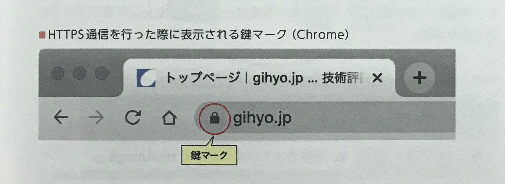
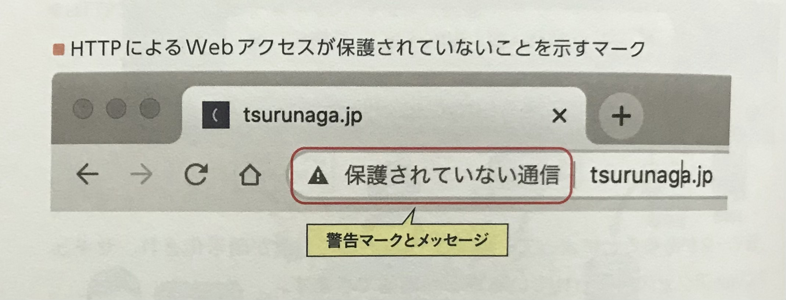

## 🟧 HTTPのセキュリティ機能の問題点
* **通信が暗号化されていないため、盗聴を防ぐことができない**
* **サーバーのなりすましを防ぐことができない**
* **ホームページや通信内容の改ざんを防ぐことができない**

「**HTTP/1.1**」に限らず、**プロトコルの多くはセキュリティ面で不安を抱えており、"拡張機能"によってその問題を解決している**。  

HTTP/1.1 では **暗号化していない「平文」でやりとりされるため**、通信内容の覗き見や収集（**盗聴**）が可能になっている。  

HTTPだけでは、**リクエストに対するレスポンスが「正規」のものか確認できないため**、ホームページをそのままコピーした偽のWebサーバーに誘導される「**なりすまし**」にはまる危険性もある。  

またWebサーバーから見ても、**クライアントが正規のものか十分に確認する手段がないので**、意味のないリクエストを大量に受け付けて**サービス不能に陥ってしまう「DoS攻撃」などのリスクも抱えている**。  

他にも、**Webページの改ざんや、コンテンツ書き換えによるウイルスのばらまき**などによって、周りの人間にも大きな被害を与えてしまうので、**Webサーバーにあるデータと、クライアントがダウンロードしたデータが同一がどうか、通信経路上で改ざんされていないかをチェックする**などの対策が必要となる。  

 
 
 

## 🟧 セキュアなHTTPS
HTTPのセキュリティ面での不安を解消し、より安全なアクセスを行うためのプロトコルが「**HTTPS**」である。  
これは「**SSL**」や「**TLS**」などのセキュアなプロトコルによって、**送受信データを暗号化してネットワーク経路上での盗聴を防ぐことができる**。  
そのような経緯から、古い資料では「**HTTP over SSL/TLS**」と表記している場合もある。  

 
 
 

## 🟧 ブラウザーのHTTPS対応
2021年現在、ほぼすべてのブラウザーでHTTPSに対応している。  
アドレスバーに「**https://**」で始まるURLを指定することで、HTTPS による暗号通信が開始され、**HTTPS通信に成功するとブラウザーの表示が変化し、鍵マークが表示される**。  

これにより、通信は暗号化され、安全にWebアクセスが行われていることが確認できる。  

最近では、**HTTP より HTTPS を使うことが一般的になっており**、Webサーバーによっては、**HTTP でのリクエストを自動的に HTTPS に切り替え、ブラウザーに対してHTTPSリクエストを再送するように要求する**。  
これを「**リダイレクト**」と呼ぶ。  

 

ブラウザー側でも、HTTPS によるWebアクセスがデフォルトになっており、**自動的に HTTPS のURLに加工してからWebサーバーへのアクセスを行う**。  
また、HTTPにしか対応していないWebサーバーへのアクセスを危険と見做し、**保護されていないことを知らせる「警告マークとメッセージ」が表示されることもある**。  

 
 
 

## 🟧 WebサーバーのHTTPS対応
Webサーバーで HTTPS に対応するには、「**サーバー証明書**」が必要になる。  
これは、**通信の暗号化に必要な鍵とWebサイト運営者や所有者の情報を含んでおり**、サーバー証明書によって「**通信の暗号化**」、「**なりすましの防止**」、「**改ざんの防止**」などが可能になる。  

サーバー証明者は、「**認証局**」と呼ばれる発行機関で**Webサイトの運営者や所有者の審査を経た上で発行される**。  
**自前でサーバー証明書を発行することも可能だが**、正規のものとは見做されず、ブラウザーにその旨を記したメッセージが表示される。  

 
 
 

## 🟧 SSL/TLS
インターネット上での通信を暗号化するための技術で、Webアクセスに限らず、**アプリケーションプロトコルにおいての暗号化通信の要となっている技術の一つである**。  

SSL も TLS も同じ仕組みにより暗号化通信を実現しており、**互換性はない**。  
現在実際に使用されているのは **TLS** のみで、SSL は使用されていないが、**歴史的に SSL が長く使用され一般に認知されているため**、「**SSL/TLS**」と併記したり、単に「**SSL**」とだけ表記される場合もある。  

古いバージョンには**セキュリティ面での脆弱性**があり、現在、**TLS 1.2以降**を使用することが推奨されている。  
そのため、**古い SSL/TLS が使用された場合に警告を表示したり、アクセスをブロックするようになっている**。  

 
 
 

## 🟧 共通鍵暗号方式と公開鍵暗号方式
共通鍵暗号方式では、**送信元での通信内容の暗号化と、受信側での復号に同じ鍵**を使用する。  
そのため、鍵をあらかじめ共有しておく必要があり、**第三者に知られてしまうと解読されてしまう恐れがある**。  

公開鍵暗号方式では、**暗号化に公開鍵、複合に秘密鍵**を使用する。  
秘密鍵は他人に後悔する必要がないため、**適切に保管しておけば本人以外はメッセージを解読できず、盗聴される危険性もない**。  

 
 
 

