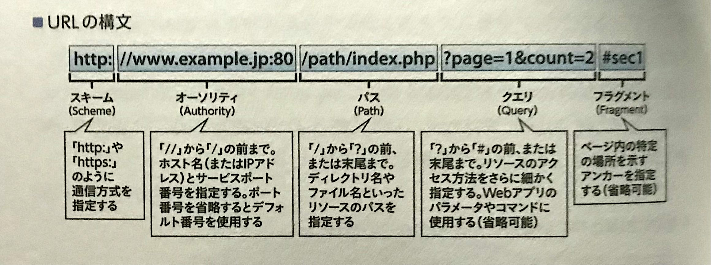

## 🟦 URLとは
URLは、**どのような手順（プロトコル）** で、**どこのWebサーバー**にある、**どのようなコンテンツ**にアクセスするかを示している。  

 
 
 

## 🟦 URLの構文

 
 
 

## 🟦 

 
 
 

## 🟦 

 
 
 

## 🟦 

 
 
 

## 🟦 

 
 
 

## 🟦 

 
 
 

## 🟦 

 
 
 

## 🟦 

 
 
 

## 🟦 

 
 
 

## 🟦 

 
 
 

## 🟦 

 
 
 

