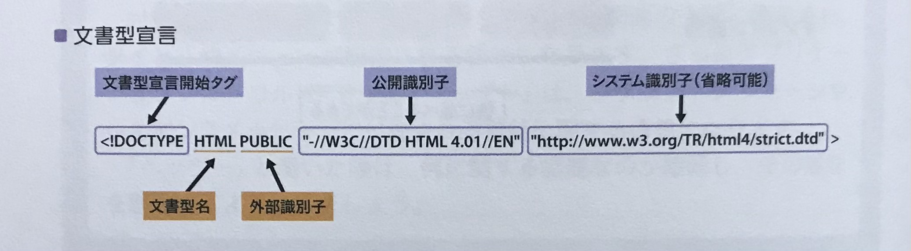
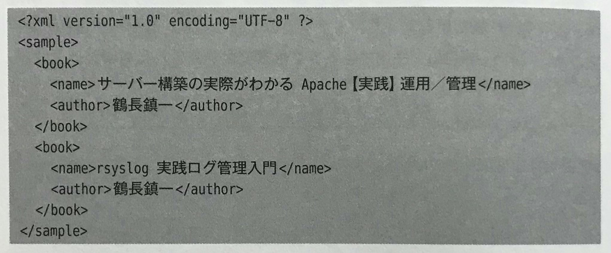
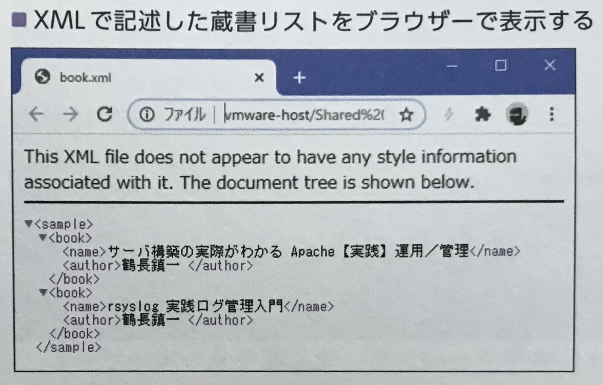

## 🟪 ブラウザーのレンダリングモード
同じHTMLファイルであれば、どのブラウザーでも同じレイアウトになるはずだが、実際はそうはならない。  
**これは、ブラウザーのレンダリングエンジンの差異によるものである**。  
この現象を無くすために、**各ブラウザーのレンダリングエンジンには「モード」が用意されており**、HTMLを解釈して画面に描画する方法を変更できる。  

<br>

HTMLでブラウザのレンダリングモードを変えるには、「**文書型宣言（DTD）**」を使用する。  
具体的には、HTMLの冒頭に「**\<!DOCTYPE ...>**」を使って宣言する。  



<br>

**標準モード**と**互換モード**の２種類がある。  
「標準モード」は、**CSSなどの仕様通りに正しく表示するモード**。  
「互換モード」は、**まだCSS普及する前のブラウザーとの互換性を維持するためのモード**。  
そのため互換モードを指定すると、**製作者が意図したレイアウトとは異なるものになる可能性がある**。  

<br>
<br>
<br>

## 🟪 HTML5の文書型宣言
最新の HTML5 では文書型宣言は**１種類**のみで、表記はシンプルに記述することができる。  
```
<!DOCTYPE html>
```
これで **HTML 5** であることを明示的にブラウザーに伝えている。  
なお省略した場合は、**ブラウザーは互換モードに設定される**。  

<br>
<br>
<br>

## 🟪 静的コンテンツ
Webサーバーがブラウザーからリクエストを受け取った後、**あらかじめ用意された画像やHTMLドキュメント**をレスポンスとして送信することで、**リクエスト内容に影響されず、常に同じ内容になるコンテンツを「静的コンテンツ」と呼ぶ**。  

昔は、**研究資料の閲覧や共有のために開発されたため、決まった内容が表示できれば事足りていた**。  


<br>

反対に、**リクエスト内容に応じてコンテンツを自動的に生成し、それをクライアントに送信するものを「動的コンテンツ」と呼ぶ**。  

<br>
<br>
<br>

## 🟪 XML
**マークアップ言語の1つ**。  
HTMLが文書の構造や見た目をマークアップするのに対し、こちらは**データ構造をマークアップする**。  
**HTML で使用できるタグは事前に定義されたものだけだが、XML は自由にタグを設定し使用することができる**。  

<br>

#### XMLの記述例



<br>

HTML では人の目で見やすいようにレイアウトされる一方、書籍名や著者名を意味のある形式で取り出すことは難しくなっている。  
対して、**XML では人の目にはわかりづらいものの、それぞれのデータの意味をタグで理解でき、「パーサー」と呼ばれる変換プログラムを使って、用意にデータを抽出できる**。  

<br>
<br>
<br>

## 🟪 API
**Webベースでの通信方式を使って、データの連携を可能にしたものを「Web API」と呼ぶ**。  
その中でも広く普及しているのが「**REST API**」である。  
これは、**パラメータを付加したURLを使ってWebサーバーにアクセスするだけで、XML で記述されたメッセージをレスポンスとして受け取ることができる機能**。  

<br>

例えば、「**郵便番号検索API**」を使った場合、**URLの末尾郵便番号を記してアクセスすると、XMLドキュメントが表示され**、各要素を取り出すことで様々な用途に活用できる。  
Amazon や Google など大手サイトでは無償で REST API が公開されており、**これらを利用することで、かんたんにアプリケーションの機能を向上させることができる**。  

<br>
<br>
<br>

## 🟪 JSON
Webサービスでやりとりされるデータ形式として、**XML** は長年利用されてきたが、**近年では代わりに「JSON」が利用されるようになってきた**。  
JSON は XML に比べて、**ファイルサイズが小さい、人の目で確認して修正できる**、などのメリットがある。  

<br>
<br>
<br>
