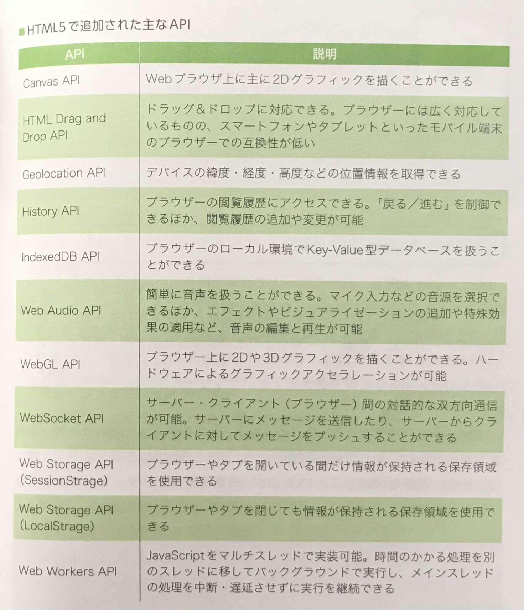

## 🟩 APIとは
**あらかじめ用意された機能を他の人たちが利用するために提供されるインターフェイスのこと**。  
使いたい機能をイチから作る必要がなくなり、**API**を実装することで手軽にその機能が使えるようになる。  
「**Web API**」とは、**HTTP / HTTPS を介して利用される API のことで**、HTTP / HTTPS で通信を行うことにより、**異なるプログラミング言語で作られたアプリケーション間の通信も可能になる**。  

 
 
 

## 🟩 HTML5で追加された主なAPI
従来はサードパーティ製プラグインが必要だった機能が、**ブラウザーだけで実現可能になった**。  
UIのインタラクティブ化、**2D/3Dグラフィックスの描画**などの機能があり、また、**HTML5 に対応してさえいればいいため、クロスプラットフォーム化も容易に実現できる**。  

 
 
 

## 🟩 WebGL APIとは
**ブラウザー上で2D/3Dグラフィックスの描画を可能にする技術**。  
「**ハードウェアアクセラレーション**」にも対応している。  

>  【**ハードウェアアクセラレーション**】  
> CPUが行なっていた処理を「**GPU**」に任せること。  
> これによりCPUの負荷を軽減でき、かつGPUの性能を上げることで、**動画再生や３Dグラフィックス処理などの高速化**を実現できる。  

 

これを実装しようとすると、**2D/3Dグラフィックスの専門知識を身につける必要があり、記述するコード量も膨大になるため、ライブラリーの活用は欠かせない**。  
数ある Web GL ライブラリーの中でも人気なのが「**three.js**」である。  

 
 
 

## 🟩 CMS
すべて自分でWebサイトを立ち上げ、日々更新していくには、**あらゆるノウハウが必要な上、手間もかかるので大変である**。  
このような場合は「**CMS**」を導入することで、比較的容易にコンテンツの作成や更新が可能になる。  

>  【**CMS**】  
> Webコンテンツを構成するテキストや画像、レイアウト情報などを**一元管理**し、Webサイトの更新を可能にしたシステムのこと。  
> 通常は、**WebサーバーにCMSをインストールして、Webサイトの管理者はブラウザー上でコンテンツの管理をする**。  

 

CMSには、デザインパターンが定義された「**テンプレート**」が用意されていて、その中から自分好みのものを選び、**あとはフッターや本文などを修正するだけで、オリジナルのWebコンテンツを作成できる**。  

 
 
 

## 🟩 CMSのメリット

* **特別な知識がなくてもWebサイトの作成・管理が行える**
* **テンプレートを使用することで、複数人で更新作業を行うときにレイアウトがバラバラになる問題を防ぎ、統一感を持たせる**
* **「グローバルナビゲーション」を自動生成する**
* **Webページを追加するたびに修正する必要がある「ローカルナビゲーション」が自動生成される**
* **検索サイトで推奨されているWebサイトの構造に倣っているため、「SEO対策」にも役立つ**
* **CMSのアクセス解析機能を使えば、「マーケティングツール」としても活用できる**
* **ユーザーに応じてレイアウトを自動で変更したり、デバイスによって最適なWebページを自動生成する**

 
 
 

