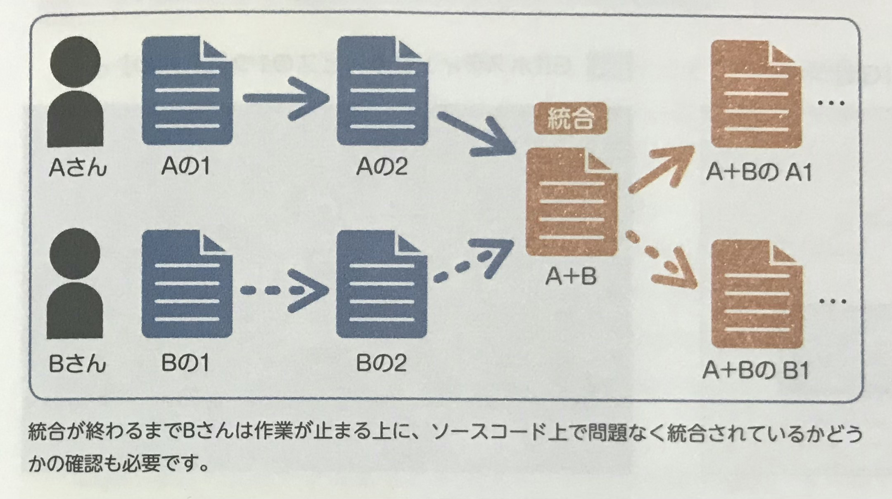
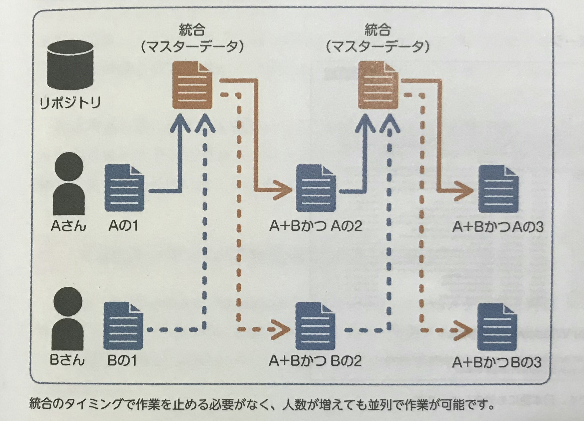
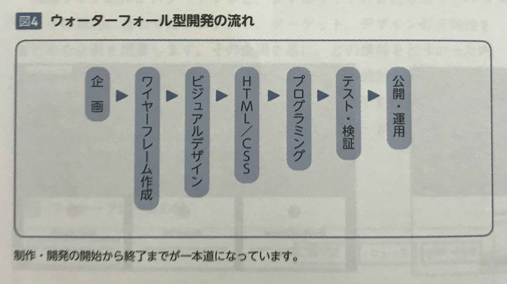
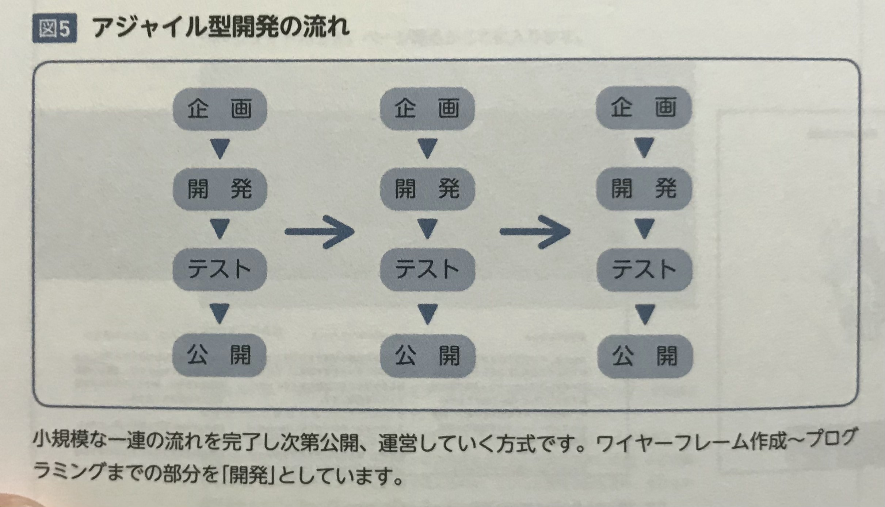

## バージョン管理システム 
同じプロジェクトを同時に進めようとした場合、ある程度の作業が進んだタイミングで両方の作業を一旦止めて、  
人力でそれぞれのソースコードの違う部分を抽出して" 統合 "させる必要がある。  

（人力でデータを統合する例）

こういった問題を解決するのが「バージョン管理システム」であり、  
データの変更点、変更した人、変更した日時などの履歴を保管することができる。  

また、過去の特定のタイミングに遡って、データを復元することもできる。  

（バージョン管理を利用する例）

これにより、ソースコードの統合をしやすくすることができる。  

  

## Webサイト開発の効率を上げる開発環境
Webサイト制作のうち、より大規模に作っていくことを「Web開発」と呼ぶ。  
開発を行なっていく上で必要な設定、各種ソフトウェア、ツールやシステムを「開発環境」といい、これを揃えることが重要になってくる。  

" Sassファイル "が差異なくコンパイルされるよう" **タスクランナー** "と設定ファイルを利用する開発環境は多い。  
また、バックエンドでのエミュレーションをするために、Linuxなどを「仮想環境」で用意することもある。  

開発環境には" エディター "も含まれるが、これは好みが分かれるツールなので、それぞれの開発者で違うことも多い。

  

## タスクを自動化する 「タスクランナー」 
保存と同時に「コンパイル」と「ブラウザのリロード」が自動で行われる仕組み、その他以下の自動化も可能 
* Sass だけでなくHTMLやCSS、JavaScriptファイルの更新時にブラウザをリロードする
* CSSにプレフィックスをつける
* 画像、CSS、JavaScriptを圧縮する
* HTMLメタ言語のコンパイル

  

## Webサイト制作の仕事の流れ
サイトの目的を決め、それらをもとに" ワイヤーフレーム "やプロトタイプと呼ばれる骨子を作成する。  
ワイヤーフレームに問題がなければ、デザインカンプを作り込んでいく。  

" **CMS** "やフレームワークを採用している場合、別途プログラミングや、Webサーバーへシステムをインストルールする場合もある。  
>  【CMS】  
> HTMLやCSSなどの専門知識がなくとも、管理・更新ができるように構築されたシステム  
> 代表的なものとして Wordpress などがある  

  

## ウォーターフォール開発とアジャイル開発 
完成までワークフローに沿って順番に進めていく開発手法を「**ウォーターフォール開発**」と呼ぶ。  

  

 

対して、開発対象を細かく分けて、小規模な開発を繰り返すことで完成に近づけていく手法を「**アジャイル開発**」という。  

ウォーターフォール開発の場合、前の工程に戻ることは難しく、先を見据えた開発が必要となる。  
一方アジャイル開発の場合、一度でWebサイトが完成することはないので、企画〜完成までのワークフローを複数回繰り返すことになる。  

>  【ポイント】  
> Webサイト制作は、細かく分けるのが難しいので**ウォーターフォール開発**で進める場合が多い  
> 対して、稼働中のWebサイトへの新規コンテンツの追加や、パーツを改修するときなどに**アジャイル開発**が用いられる場合が多い  

  

## デザインカンプを受け取った後のワークフロー 
* 余白
* サイズ
* 色
* フォント周りの情報
* テキスト
* 画像  

これらの情報は、コーダーが反映させることになる。  

各種デザインツールから情報を取得するとき、情報の取得方法や「画像の書き出し」に差が生まれてしまうため、  
コーダーはそれぞれのツールについての情報の取得方法について問題なく扱える必要がある。  （またツールも保有しておく必要がある）  
>  【画像の書き出し】  
> デザイン還付に配置された画像部分を、HTMLやCSSから読み込める画像形式 （jpg、png、svg、gif） として取り出すこと  

  

## コーディングガイドラインを用意する 
作業者に守って欲しい項目をまとめたものを用意する。  
HTMLの文字コード、インデントの記号、対象のブラウザ、ファイル名の命名規則などがそれに当たる。  

個々の状況に合わせて 「こんなふうに書くとよりよい」 という例を用意しておくとわかりやすい。  

[【本書のコーディングガイドライン】](https://github.com/nori44/coding-guidelines)

