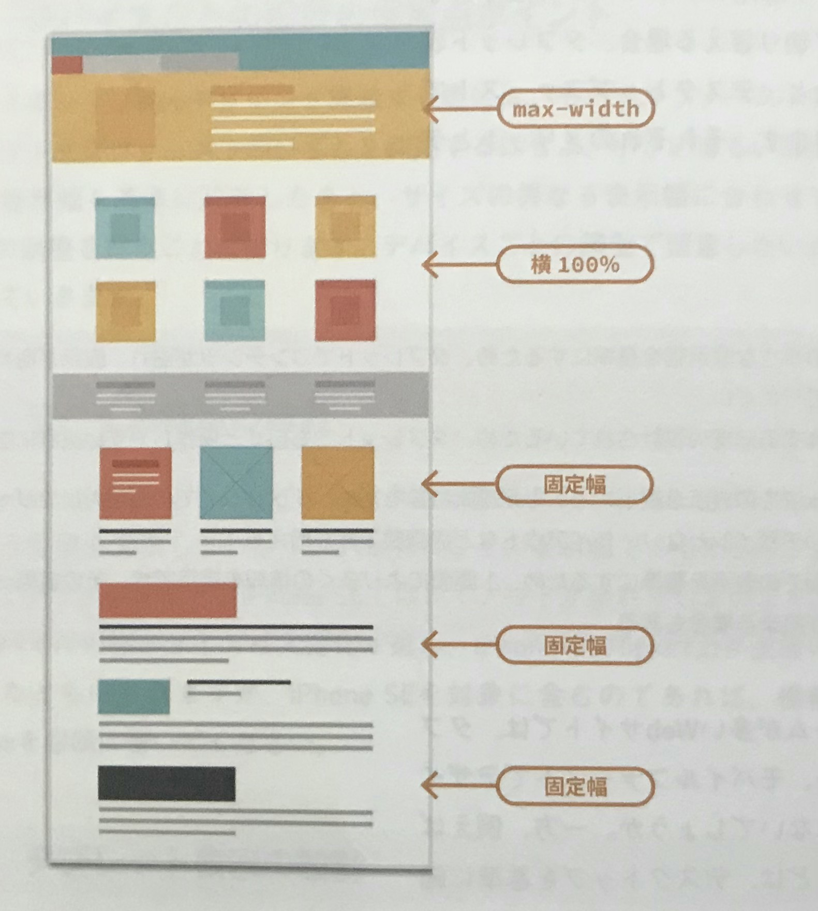

## レスポンシブ対応のこれまで 
レスポンシブWebデザインとは、Webサイトの制作手法の１つで、デバイスごとに別々のHTMLを用意するのではなく、  
１つのHTMLをベースに、多様なデバイス・環境での閲覧に対応する手法をいう。  

この手法が確立する以前は、デバイスごとに作り分けていた時代もあった。  
その頃は、デスクトップ用に製作したサイトを基準にして、モバイルサイトのデザインを決定する制作フローを使っていて、  
トップページのみで構成したり、コンテンツを省略したりしていた。  

このやり方では**最低でも２つ**、タブレットも含めるなら**３つ**のデザイン・HTMLを作成することになり、大変なコストがかかった。  
**また、現在でも UI も大きく変える場合は、意図的に別サイトの対応が行われることがある**  

#### 【デバイスごとに別対応するメリット・デメリット】
|メリット|デメリット|
|:-|:-|
|・各デバイスに適したデザインを実装できる|・運用コストがかかり、変更を加える場合はすべて修正しないといけない　（CMSを使うと修正の手間は軽減できる）|
|・モバイルサイトではコンテンツや画像を軽量化したり、さまざまな最適化が行える|・制作コストがかかる|

  

## デスクトップファーストとモバイルファースト 
以前はデスクトップ用のサイトを最初に制作し、モバイル用にそれを１カラムで表示させる、というのが主流だった。（デスクトップファースト）  

しかしこのやり方では、大きな画面を基準にコンテンツを作成することになるので、  
どうしてもコンテンツが増え、モバイルサイトで表示したときに溢れてしまうという問題も起こっていた。  

なので近年では、モバイルを基準にして設計してから、  
CSSを大きなデバイス用に切り替えていく、という手法が主流になっている。（モバイルファースト）  

>  【メモ】  
> モバイルファーストは手法や考え方を指す言葉で、「モバイルサイトを先に作る」という作業手順のことではない  

  

## ブレイクポイントの考え方 
ブレイクポイントの数値をいくつで設定するか、という部分に絶対的な正解はなく、  
ブレイクポイントの数もデバイスの切り分け数によって変わっていく。  

比較的よくあるのは、  
「スマートフォンと表示幅が小さめのタブレット」と「表示幅が広めのタブレットとPC」の境界にあたる  
「768px」をブレイクポイントとするケース。  

ほかには、  
スマートフォンとタブレットの境界にあたる「415px」と、  
タブレットとPCの境界にあたる「960px」の**２つ**をブレークポイントとする例などがある。  

スマートフォンの新機種が登場すれば、表示幅の主流やシェアは移り変わるし、どの年代までをカバーするかにもよって変わってくる。  
なのでブレークポイントに絶対は存在しない、というのを覚えておく。  
>  【ポイント】  
> 現在普及しているスマートフォンの画面幅は「320px」〜「414px」で、タブレットは「600px」〜「834px」である  
> **ipad** などのタブレットで最も多いのが「768px」となっている

  

## デバイスごとの設計の留意点ポイント 
レスポンシブWebデザインを実装する際には、モバイルファースト、デスクトップファーストのいずれを採用するにせよ、  
小さい、あるいは大きい表示幅を基準に設計したあと、サイズの異なる表示幅に合わせてCSSの調整を行うことになる。  

 

### <モバイル表示>の設計 
 **iPhoneSE** など、小さいサイズを基準にするのであれば、「320px」という数値を考慮する。  
 
 **iPhoneX** などの表示幅である「375px」に合わせてデザインすると、**iPhoneSE** ではレイアウトが崩れてしまう。  
近年では大型化が進み、「375px」以上が主流になったともいわれるが、**iPhoneSE** を対象に含むのであればそれを念頭に置いておく。  

 

### <タブレット表示>の設計 
タブレット用の画面を作るとき、モバイル用に作成したコンテンツを基準にする場合、  
「タッチ操作のしやすさ」を意識しながら、タブレットの画面に合わせた調整を行っていく必要がある。  

#### 【タブレット表示で調整する主なポイント】
||||
|:-:|:-|:-|
|**カラムの表示数**|・モバイル版では１カラムの縦レイアウトで表現されている部分は、横に並べた方が一覧表示などが見やすくなる。||
|**フォントサイズ**|・横幅や画像がモバイルに比べて大きめに表示されるのに対して、文字サイズが同じままではバランスが悪い。|・本文の文字サイズを大きくした場合はバランスを考慮し、見出しなどの他の文字サイズも調整する。|
|**コンテンツの最大値**|・モバイルでの表示時には、横幅を表示領域の100%で指定する箇所が多くなる。|・タブレットの画面で横幅100%は非常に読みづらいので、コンテンツ幅に最大値（max-width）を設定する。|

 

制作にかけられる予算や時間の関係で、タブレット専用のデザインが作成されない場合もある。  

また、タブレット表示をモバイルファーストで設計するか、デスクトップファーストで設計するかも検討する必要がある。  

 

#### 【タブレット表示の設計の留意点】
||||
|:-:|:-|:-|
|**モバイルファーストの場合**|・モバイルの小さな表示幅を基準にするため、コンテンツが溢れ、表示が崩れる問題が起こりにくい|・タッチ操作する前提の設計がされているため、タブレットでも自ずと操作しやすい設計になる。|
|**デスクトップファーストの場合**|・デスクトップ画面の縮小が基本となるため、タブレットではクリックしづらいデザインになり、レイアウトの調整工数も増える。|・大きな画面が基準となるため、１画面により多くの情報を表示でき、一覧性や操作性が高まる場合もある。|

 

これらを考慮すると、特に入力フォームが多いWebサイトでは、タッチ入力の操作性の点から  
「モバイルファースト」でのデザインが適していると言える。  

一方、カードレイアウトを多用する一覧ページなどは、「デスクトップファースト」で作成した方が一覧性が高まる。  

また、グローバルナビゲーションはデスクトップを基準にした方が、開閉操作のナビゲーションよりアクセスのしやすさは向上する。  
この部分を柔軟に調整できるようになると、レスポンシブ実装の腕前が上がったと言える。  

 

### <パソコン>表示の設計
PC表示では、コンテンツを表示する横幅の固定・可変の設計がポイントになる。  
「**リキッドレイアウト**」を指定する箇所では、Webブラウザの表示領域に対して横幅100%を指定した上で、  
 **min-witdh**（最小値）と **max-width**（最大値）を決め、幅が可変する部分と固定する部分を決める。  

>  【リキッドレイアウト】  
> 「リキッドデザイン」とも呼ばれる、ブラウザの表示幅の変動に応じて、コンテンツのサイズも変更されるデザインのこと  
> 表示領域が変化してもレイアウトが保持されるメリットがあり、複数のボックスで構成されるページであれば、各ボックスの幅を固定して指定する  

例えば、メインビジュアルなどのインパクト出したい部分は、画像を横幅100%でリキッドレイアウトを指定する。  
逆にテキストを表示する部分は、横幅の最大値を決めるほうが、１行あたりの文字数が増えすぎず読みやすい文章になる。

  

横幅を可変とする箇所は、画像に対して文字が小さくなりすぎないように、**font-size**（文字サイズ）を検討しよう。  

一般的には、表示幅が変化しても文字の大きさは同じままにしたほうが見やすいことが多いが、そこも柔軟に対応していく。  
表示幅が広がった際に、文字サイズを画像に対して同じ比率にしたい部分は、「相対サイズ」を指定する。  

  

## コンテンツの外側に余白

