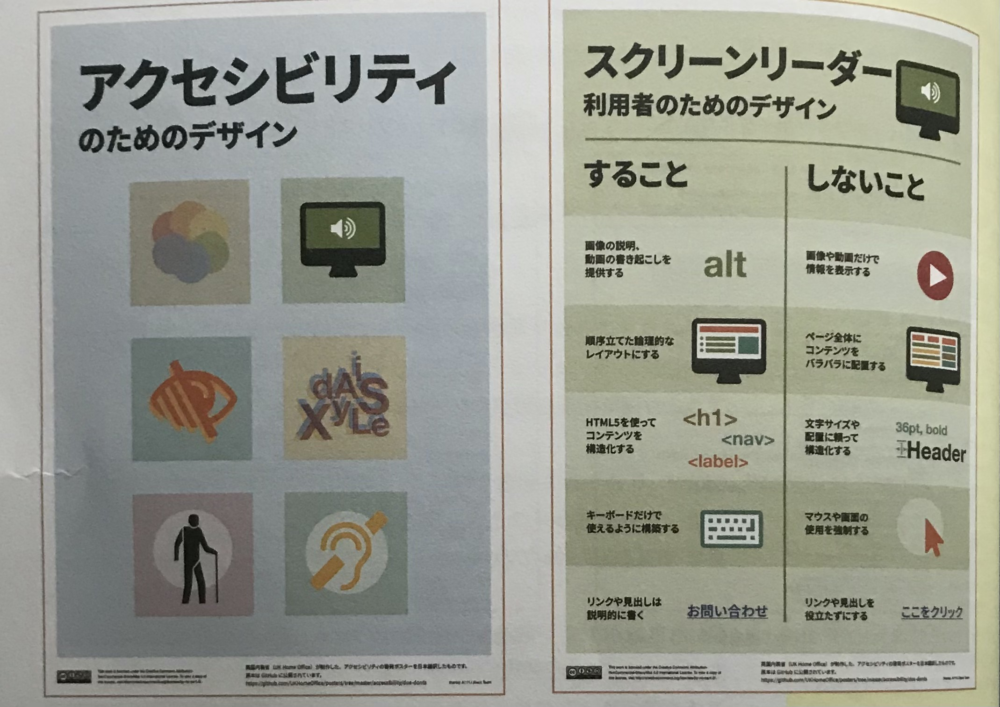

#### 英国内務省が製作したアクセシビリティの啓発ポスター

[【アクセシビリティのためのデザイン -日本語訳】](https://utelecon.adm.u-tokyo.ac.jp/online/shared/accessibility-posters-set_ja.pdf)

 

Webアクセシビリティというと「障害者や高齢者のための対応」と捉えられがちだが、決してそうではなく、  
サイトにアクセスするあらゆるユーザーにとって必要とされるものである。  

