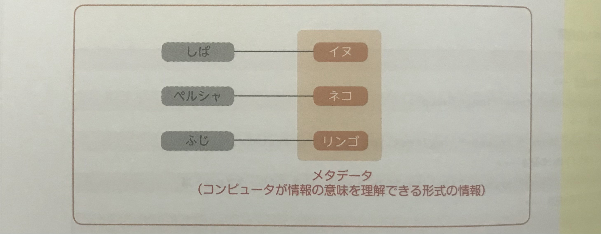

## セマンティックWebとは
Webページに記述された内容の意味をコンピュータにも理解しやすい形で伝える、利便性の高いサイトのこと。  
検索エンジンへの最適化やアクセシビリティ対応の基本技術ともなる、重要な考え方となる。  

<br><br>

## セマンティックWebの考え方
セマンティックWebは元来、Webページに記述された内容が何を意味するか、メタデータを付加することで  
コンピュータに理解しやすくし、コンピュータ同士で自立的に処理させるためのプロジェクトであった。  

コンピュータが理解できる形式の情報が付与されている状態を「**マシンリーダブル**」ともいう。  
Webサイトが「マシンリーダブル」な状態は、コンピュータだけでなく、人にとっても利便性が高いものになる。  

（マシンリーダブルな状態）


HTMLは文書構造をコンピュータに伝えるマークアップ言語であるが、  
単に伝えるだけでなく、個々の情報をより一層正しくコンピュータに理解しやすくするのが、セマンティックWeb的な配慮といえる。  

>  【ヒューマンリーダブル】  
> 人が読み取れる状態を「ヒューマンリーダブル」という

<br><br>

## セマンティックな状態にするメリット
* 検索エンジンがコンテンツの中身を理解し、インデックスされることで、アクセスアップが見込める
* 音声ブラウザやスクリーンリーダーの読み上げ機能や、操作補助機能にデータを利用でき、アクセシビリティが向上する
* GoogleHomeなどのスマートスピーカーの音声入力に対応できる
* ブラウザのフォーム入力の補助機能に対応できる
* Facebook、Twitterなどの外部サービスにWebサイトの情報を表示できる
* **セマンティックなネーミングやタグ属性を使うことでコンポーネント設計に役立つ**

<br>

マシンリーダブルな状態でなくても、表面的見た目は変わらないことが多く、  
マシンリーダブルにするための対応にはコストかかるので、対応してないWebサイトも数多く存在する。  

しかしそれを実装することで、結果的にユーザーがアクセスしやすいユーザビリティの面でも優れたサイトになるので、  
できる限り対応するようにする。  

<br>

マシンリーダブルな対応には具体的に以下の技術を使う。  

* Web標準に従い、文書の構造・要素をHTML5でマークアップする
* WAI-ARIA、メタ情報、構造化データを使用して、コンピュータが理解できる情報を付与する
* テキスト情報として、コンピュータが解釈できない画像や動画に代替テキスト（**alt属性**）などを付与する

<br><br>

## HTML5でのマークアップ
最新の標準仕様であるHTML5では、それまで存在しなかったセマンティックなタグが数多く追加された。  
文書のセクション構造を示す`<header> <main> <nav> <section>`などの要素がその代表格である。 

HTML4の時代にはこれらの要素が存在しなかったため、すべて`<div>`タグでマークアップしていたが、  
それではここのセクションが持つ意味や役割がコンピュータには伝わりにくかったといえる。  

>  【POINT】  
> HTML5のタグで適切にマークアップしたとしても、そのWebページがどういったジャンルに属するコンテンツを扱っているかなど、  
> 細かい情報まではコンピュータは判断できないので、こうした情報はメタデータで伝える必要がある。  

<br>

#### HTML5で追加された文書の構造を示すタグ
|タグ|意味|
|:-:|:-|
|`<header>`|ヘッダー|
|`<footer>`|フッター|
|`<main>`|メインコンテンツ|
|`<nav>`|ナビゲーション|
|`<section>`|マークアップされた箇所が１つのセクションであることを示す|
|`<article>`|単体で内容が完結するセクション|
|`<aside>`|補足的なコンテンツ（補足説明やサイドバーなど）|

#### HTML5で追加されたコンテンツの中身を示すタグ
|タグ|意味|
|:-:|:-|
|`<figure>`|図表|
|`<figcaption>`|図表のキャプション|
|`<video>`|動画|
|`<time>`|日時|

<br><br>

## alt属性を指定する
画像をマシンリーダブルにするためには**alt属性**を使う。  

コンピュータは、写真やイラストなどから中身を読み取ることはできない。  
例えば、人間は「毛足の長い小型犬」だったり、「後ろを振り向いてる様子」といった情報を読み取ることができるが、  
コンピュータは" 画像 "であることしか読み取れない。  

```

```

なので、このように**alt属性**に記述することで、「どのような姿・状況の犬」かをコンピュータにわからせることができる。  

また、バナー画像やタイトル画像など、画像に文字情報を含むものは、`alt`に文字情報を記述する。  
そうすることで、検索エンジンやスクリーンリーダーも情報を理解できるようになる。  

<br><br>

## メタ情報の重要性
メタ情報とは、「情報についての情報」を指す。  
HTMLの`<head>`タグ内に記述する、「Webページそのものの情報」をメタ情報という。  

メタ情報は`<meta>`タグを使って記述され、  
**Webページが何の言語で書かれているか、Webページの説明文、レスポンシブ対応させるための情報**など、  
「情報についての情報」、「その文書についての付帯情報」を示すものである。  

メタ情報に厳密な決まりはないが、よく記述されるものは以下のようなもの。  

```
<meta charset="utf-8">  //Webページの文字コードを指定する
<meta name="keywords" content=""> //Webページのキーワードを指定する
<meta name="description" content="">  //Webページの説明文を記述する
<meta name="robots" content="noindex,nofollow"> //Webページを検索ロボットが探せる/探せないように指定する
<meta name="viewport" content="width=device-width, initial-scale=1, miximum-scale=1"> //viewport指定をする
```

<br><br>

## 構造化データの記述
構造化データとは、HTMLで書かれた情報を検索エンジンにも理解しやすいように意味づけしたもののこと。  
検索エンジンはWebページのコンテンツを理解するだけでなく、その情報から紐づいた様々な情報を収集する。  

「**schema.org**」という**構造化データの規格**が存在しており、GoogleやYahoo！などの検索エンジンが対応している。  
構造化データによって情報を付加することで、検索エンジン経由での訪問者の増加が見込める、SEOの観点でも重要な技術である。  

[【構造化データの仕組みについて】](https://developers.google.com/search/docs/advanced/structured-data/intro-structured-data?hl=ja)  

フォーマットに則り、上記サイトのような情報を記述することで、Google検索結果にサイトの情報を表示することができる。  
例えば、製品のレビューサイトであれば、商品画像、価格、ブランド名、レビュー評価数などのデータを指定する。  

<br><br>

## WAI-WAIを使ったアクセシビリティ対応
「**WAI-WAI**」とは、**Web Accessibility Initiative**（W3Cの中のWebアクセシビリティに関する仕様を検討する部会）  
が策定した、アクセシブな**RIA**（リッチインターネットアプリケーション）に関する技術仕様のこと。  

この仕様に対応することには、次のようなメリットがある。  

* フォームのアクセシビリティを向上する
* `div`に**role属性**を付与することで、マシンリーダブルになる
* 属性をつけることでインタラクションによる状態変化を伝える
* HTMLの文書構造に影響しない形で、状態変化とCSSを紐づけることができる

特に重要なのは、**role属性**と**aria属性**を付与して、  
コンピュータをはじめとする機械コンテンツの役割や状態、性質を明示すること。  

これらの情報を機械が読み取ることで、さまざまな環境からWebサイトにアクセスするユーザーに適切な情報を提供できる。  

<br>

#### 【WAI-WAIの機能】
|WAI-ARIEの機能|読み方|意味|
|:-|:-:|:-|
|**Role**|ロール|主にランドマークロールを定義する。 UI で多く指定される。|
|**Property**|プロパティ|要素の性質を定義する。主にフォームの情報や画像の代替情報として意味を追加するものがある。|
|**State**|ステート|要素の現在の状態を定義する。主に JavaScript の切り替えによる状態変化に使われる。|

<br>

### コンテンツの役割を表すrole属性
**role属性**はコンテンツの役割を示すもので、  
役割を示したいHTMLのタグに`role="main"`などのように付与する。  

```
<div role="main"> ~ </div>

<main> ~ </main>
```
★ この場合はどちらも、その要素がメインコンテンツであることを示す。  

**role属性**には、コンテンツのナビゲーション上の役割を表す**ランドマークロール**という仕様がある。  
ランドマークロールに対応するHTMLタグがある場合、**role属性**は必要ない。  

>  【memo】  
> ランドマークはページ内のナビゲーションを容易にするWAI-ARIAの技術仕様  
> コンテンツのナビゲーション上の役割を**role属性**を使って示すものである

<br>

#### 【主なランドマンドロール】
|ランドマークロール|意味|対応するHTMLタグ|
|:-|:-:|:-:|
|**applocation**|アプリケーションのコンテンツ|-|
|**article**|記事|`<article>`|
|**banner**|メインビジュアルのバナー|`<header>`|
|**complementary**|補足コンテンツ|`<aside>`|
|**contentinfo**|コンテンツ情報|`<footer>`|
|**form**|入力フォーム|`<form>`|
|**main**|メインコンテンツ|`<main>`|
|**navigation**|ナビゲーション|-|
|**search**|検索フォーム|-|
|**alert**|アラーム、警告|-|
|**alertdialog**|button などの UI を含むアラート、警告|`<button>`|
|**button**|ボタン|-|
|**checkbox**|チェックボックス|-|
|**dialog**|ダイアログ|-|
|**progressbar**|プログラスバー|-|
|**slider**|数値を変更する|-|
|**tab**|タブ UI の見出し|-|
|**tabpanel**|タブ UI のコンテンツ|-|
|**timer**|タイマー|-|
|**tooltip**|ツールチップ|-|

<br>

### コンテンツの状態や性質を表すaria属性
**arie属性**はコンテンツの状態や性質を示すものである。  
HTMLのタグに`arie-XXX="〇〇〇"`のように記述する。  

状態を表す**aria属性**では、属性値に「**true**」または「**false**」を指定する。  
動的な UI に状態を示すことで、アクセシビリティを高めることができる。  

[【aria属性の一覧】](https://momdo.github.io/wai-aria-1.1/)

```
<a href="〇〇〇〇" aria-disabled="true"> リンクが入ります </a>
```
上記は、`aria-disabled="true"`でリンクがクリックできない状態を示し、マシンリーダブルに対応した記述例である。  
機能としてクリックできない状態になるわけではなく、「**クリックできない状態**」という意味を示すマークアップになっている。  

<br>

```
<div class="textContents" aria-busy="true"> 読み込み中 </div>
```
上記は、`aria-busy="true"`という記述で読み込み中の状態を表し、マシンリーダブルに対応した例。  
読み込み完了時に`aria-busy="false"`と返すことで、読み込みが完了したことを示すことができる。  

また、この属性をCSSセレクタに使用することでスタイルを適用できる。  
状態を示す`class`を追加する方法と比べて、意味と表記の統一性が確保できるため、状態変化をCSSで指定するよい方法といえる。  

```
.textContents[aria-busy="true"] {
  background-color: #999;
}
```


