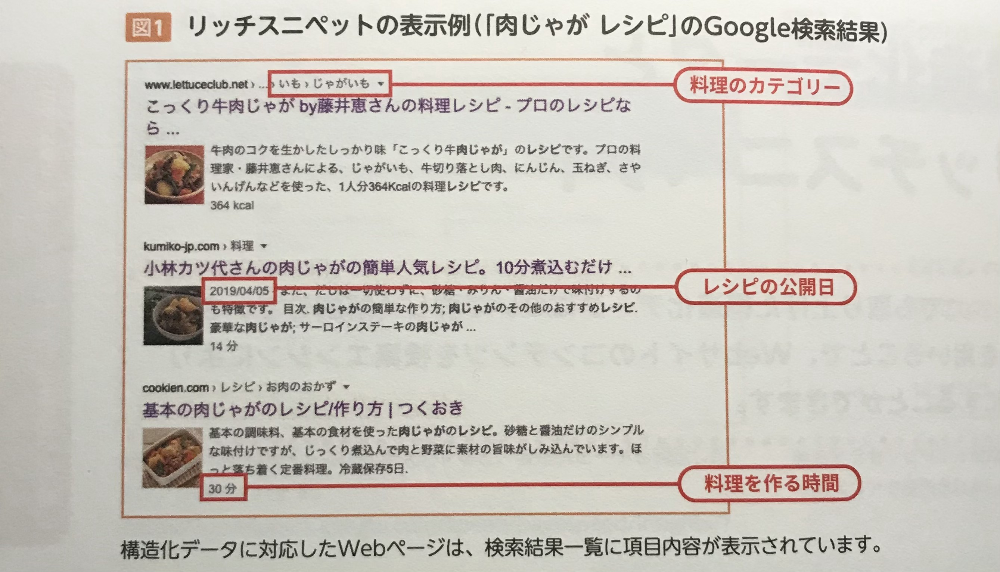

※　ここでは[【Lesson2-03】](https://github.com/tamayura8823spirit/siteExample02/blob/main/%E5%8F%82%E8%80%83%E7%94%A8%E3%82%B3%E3%83%BC%E3%83%88%E3%82%99%E9%9B%86/%E3%81%A1%E3%82%83%E3%82%93%E3%81%A8%E3%81%97%E3%81%9F%E3%83%97%E3%83%AD%E3%81%AB%E3%81%AA%E3%82%8B/Lesson2/%E3%82%BB%E3%83%9E%E3%83%B3%E3%83%86%E3%82%A3%E3%83%83%E3%82%AFWeb%E3%82%92%E6%A7%8B%E7%AF%89%E3%81%99%E3%82%8B%E3%81%9F%E3%82%81%E3%81%AE%E6%8A%80%E8%A1%93.md#%E6%A7%8B%E9%80%A0%E5%8C%96%E3%83%87%E3%83%BC%E3%82%BF%E3%81%AE%E8%A8%98%E8%BF%B0)でも取り上げた「**構造化データ**」について詳しく解説していく  

<br>

## 検索エンジンが文字列の意味を理解しやすくなる
構造化データとは、  
「**コンテンツの中に含まれる文字列が持つ意味を、検索エンジンがより理解しやすくなるように標準化されたデータ形式**」のことで、  
これを利用すると、Webサイトと検索エンジンをより親和性の高い状態にすることができる。  

通常のHTMLのマークアップでも、テキストが持つ**役割**を意味づけることはできるが、  
**テキストそのものの意味**までは読み取ることができない。  

構造化データを使ったコンテンツを数多く収集することで、  
検索エンジンは**文字列の意味**や**文字列が使われる文脈・背景**を学習し、累積していく。  

<br><br>

## 検索結果にリッチスニペットが表示される
構造化データを用いるメリットに、検索結果での**リッチスニペット表示**がある。  

通常、検索結果にはWebページのタイトルと説明文が表示されるが、構造化データに対応したページではそれ以外にも、  
**ユーザーががページの内容を想像できるような「リッチ（豊富）な情報」が表示され**、クリックされやすくなる傾向がある。  

これを" **リッチスニペット** "といい、Googleでは「**リッチリザルト**」と呼ばれている。  

<br>



<br>

構造化データに対応したページでは、**レシピのカテゴリー**、**調理にかかる時間**、**レシピの公開日**、  
**レシピのカロリー**などの項目がリッチスニペットとして表示されている。  

ユーザーはこれらの情報を見て、「作り方がわかりやすそう」、「短時間で調理できそう」などの判断が働き、  
**サイトへの流入数のアップが見込める**ため、SEOの観点から有利といえる。  

<br><br>

## 構造化データの規格と記述方法
構造化データには、「**Schema.org**（スキーマ・ドットオルグ）」という規格が設けられている。  
この記述方法の中で、Googleがサポートしているものは次の３つとなる。  

* **JSON-LD（ジェイソンエルディー）**
* **Microdata（マイクロデータ）**
* **RDFa（アールディーエフエー）**

Googleはこの中でも **JSON-LD** を推奨している。  
JSON-LDには次のような利点がある。  

* **Google推奨の記述である**
* **元のHTMLには影響を与えずに、JSON記述でデータを追加できる**
* **構造化データを既存サイトに追加する場合も、HTMLコードの改変が必要ない**

>  【Schema.org】  
> 米国で検索エンジンサービスを提供する Google、Mmicrosoft(Bing)、Yahoo! の３社が立ち上げた、  
> 構造化データの共通仕様を策定するプロジェクト

<br><br>

## 構造化データの記述例
料理レシピのページをサンプルに見ていく。  
下のコードは、下記画像のページで記述している構造化データである。  

```rb
<html>
    <head>
        <title>Non-alcolic Pina Colada</title>
        <script type="application/ld+json">
            {
                "@context": "https://schema.org/",
                "@type": "Recipe",
                "name": "うちの定番、鶏肉唐揚げ",
                "image": [
                "https://www.pakutaso.com/shared/img/thumb/PAKK_shokutakukaraage20150203190242_TP_V.jpg"
                ],
                "author": {
                    "@type": "Person",
                    "name": "サトウハルミ"
                },
                "datePublished": "2020-03-10",
                "description": "にんにく醤油に漬け込んだ味付けが好評です",
                "totalTime": "PT25M",
                "nutrition": {
                    "@type": "NutritionInformation",
                    "calories": "290 calories"
                }
            }
        </script>

        (省略)
        
    </head>
</html>
```


<br>

### 必須プロパティ
|プロパティ|定義|
|:-|:-|
|Image|レシピで完成した料理の画像|
|name|レシピの名前|

<br>

### 推奨プロパティ
|プロパティ|定義|
|:-|:-|
|`aggregateRating`|レシピのレビュースコアの平均値|
|`author`|レシピの作者|
|`datePublished`|レシピを公開した日付|
|`totalTime`|調理の合計時間。`prepTime`と`cookTime`を組み合わせるか単独で使用|
|`prepTime`|調理の準備時間。`cookTime`とセットで使用|
|`cookTime`|実際の調理時間。`prepTime`とセットで使用|
|`description`|レシピの説明文|
|`recipeCategory`|レシピのカテゴリ分類。デザートなどのコースの提供内容|
|`keywords`|季節、イベントなどのレシピに関するキーワード。`recipeCategory`で指定するタグを使用しない|
|`nutrition.calories`|１人分のカロリー|
|`recipeingredient`|使用する材料|
|`recipeInstructions`|調理手順|
|`recipeCuisine`|レシピに関連づけられる地域|
|`recipeYield`|レシピの完成分量。４人分、４個分など|
|`video`|レシピの調理動画|

<br><br>

## 構造化データの表示確認
構造化データで記述したページは、Googleが提供する **Google Serch Console** のツールである  
「**リッチリザルトテスト**」で表示確認を行うことができる。  

[【リッチリザルトテスト】](https://search.google.com/test/rich-results?hl=ja)

上記サイトにアクセスした後、  
「**<>コード**」タブを選択し、記述した構造化データを貼り付けて、  
[**コードをテスト**]ボタンをクリックすると、テスト結果が表示される。  

さらに、テスト結果のページで「**結果をプレビュー**」をクリックすると、Googleの検索結果画面でどのように表示されるかを確認できる。  

<br>

構造化データは記事やパンくずリストなど、コンテンツの内容・種類によってマークアップの内容も変わってくる。  
Google検索デベロッパーガイドの「**検索ギャラリーをみる**」で、各種の例を確認できるので必要に応じて参考にしよう。  

[【検索ギャラリーをみる】](https://developers.google.com/search/docs/advanced/structured-data/search-gallery?hl=ja)

<br>
