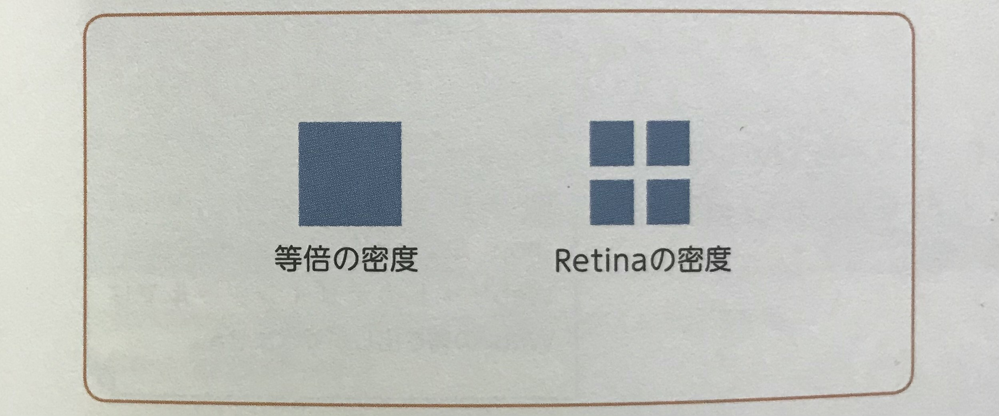

## 特性を踏まえて適切な画像フォーマットを選ぶ
Webサイトで使用する画像データは、各画像フォーマットの特性を理解した上で、  
**画質と容量の軽さを両立できるよう**、書き出すことが重要になる。  

Webページの軽量化は、画像データによって左右されるといっても過言ではなく、  
ページの表示スピードはサイトのアクセス数やPVにも影響するため、画像データの軽量化は常に意識しておきたいところである。  
>  【POINT】  
> **JPG画像**は画質の選択によって容量が違ってくる  
> 特にメインビジュアルのような大きなサイズの画像は、画質によって容量に大きな差が出るので、  
> 実際に書き出したものを比較し、見た目に大きな違いがなければ、できるだけ画質を落として使用したほうがいい  

#### 【画像フォーマット別の特徴】
|形式|圧縮方式|データフォーマット|色数|透明の表現|適した用途|デメリット|
|:-|:-:|:-:|:-:|:-:|:-|:-|
|**JPEG**|非可逆圧縮|ビットマップ|16,777,216色|不可|・写真　・色数が豊富なもの|・元の画像に戻せない　・透過を扱えない|
|**PNG-8**|可逆圧縮|ビットマップ|256色|可|・色数の少ないもの（ロゴ、アイコンなど）　・透過が必要なもの|・扱える色数が限られる|
|**PNG-24**|可逆圧縮|ビットマップ|16,777,216色|可|・色数が豊富で透過の必要なもの（イラストなど）　・画質を落としたくないもの|・容量が重くなる|
|**GIF**|可逆圧縮|ビットマップ|256色|背景透過|・色数の少ないもの　・GIFアニメーション|・扱える色数が限られる　・カラープロファイルを埋め込めない|
|**SVG**|可逆圧縮|ベクター|-|可|・拡大縮小時に劣化させたくないもの（ロゴ、アイコンなど）　・比較的単純な形状のイラスト|・複雑な色や形状は表現できない　・階調の多い写真やイラストには不向き|

  

## レスポンシブ対応する際の画像サイズ
モバイルのディスプレイには、解像度が従来のディスプレイの**２倍程度**ある高解像度の「Retinaディスプレイ」が存在する。  

Retinaディスプレイでは１pxあたりの密度が通常の２倍程度あり（図１）、  
たとえば**375px**横幅のRetinaディスプレイであれば解像度は**750px**程度ある。  

なので、等倍の画像を使用すると実際は**750px**のピクセル幅に**375px**の画像を表示していることになり、  
画像がぼやけて見える現象が発生する。  

Retinaディスプレイなどの高解像度ディスプレイへの対策として、  
通常の２倍程度のピクセル数で書き出した画像を使用することがある。  

  

## 次世代画像フォーマット
これらの新しい画像フォーマットは、Webブラウザの対応がまだ追いついていないため、  
実制作で使用する機会はまだ非常に少ないが、知識として抑えておく。  

#### 【次世代画像フォーマットの特性】
|形式|拡張子|圧縮方式|データフォーマット|透明の表現|特徴|
|:-|:-:|:-:|:-:|:-:|:-|
|**WebP**|.webp|・非可逆圧縮（Lossy WebP）　・可逆圧縮（Lossless WebP）|ビットマップ|可（非可逆圧縮でもアルファチャンネルと扱える）|従来の画像フォーマットと同程度の画質で、ファイルサイズを軽量化できる|
|**JPEG 2000**|.jpg|非可逆圧縮|ビットマップ|不可|従来の**JPEG**より、圧縮率が高くファイルサイズを軽量化できる|
|**JPG XR**|.jxr|非可逆圧縮|ビットマップ|不可|従来の**JPEG**より、圧縮率が高くファイルサイズを軽量化できる|

