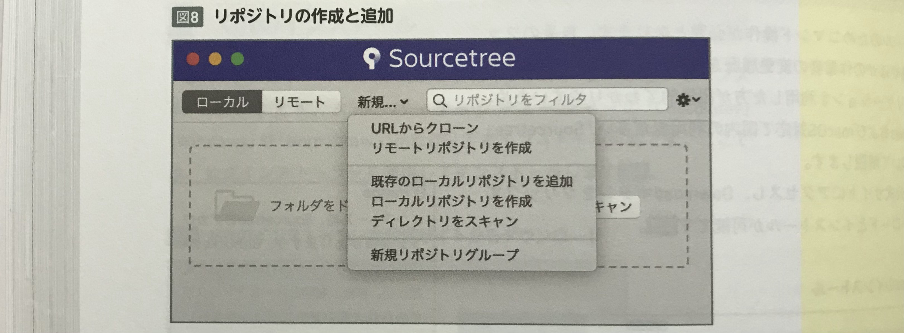
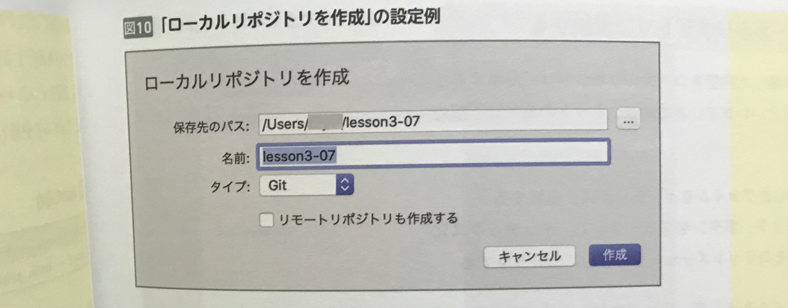

    本節では、バージョン管理システム「Git」の導入方法と、  
     Git のGUIアプリケーション「Sourcetree」の導入法について解説する。  

<br>

## Gitの仕組み
Gitでは「リポジトリ」と呼ばれる保管庫にファイルやディレクトリ情報や変更履歴を保存している。  
リポジトリには、作業者ごとのPCに作成される「**ローカルリポジトリ**」と、  
サーバー上に設置して複数人で参照・共有する「**リモートリポジトリ**」がある。  

作業者は、ファイルの変更内容をローカルリポジトリへ反映していき、最終的にリモートリポジトリへ反映する。  
リモートリポジトリに反映された内容は、他の作業者にも反映内容が表示されるため、他の作業者は更新された変更内容を自身のローカルリポジトリに取り込むことで差分を反映できる。  

リポートリポジトリは、自分でサーバーにGitをインストールすることで設置も可能だが、多くの場合はGitのホスティングサービスである  
「**GitHub**」や「**Bitbucket**」を利用することが一般的。  

<br>
<br>
<br>

## Gitのインストール
Gitのインストールは、公式サイトのインストーラーを使ってインストールできる。  
また、パッケージマネージャーの「Homebrew」でもインストール可能。  
```rb
$ brew install git
```

コマンドラインツールを立ち上げて、gitのバージョン確認コマンドを実行し、インストールしたバージョンが表示されれば完了。  
```rb
$ git --version
git version 2.30.1 (Apple Git-130)
```
macOS ではGitが標準インストールされているため、gitのバージョンコマンドを実行すると、（Apple Git-XXX）と表示される。  

<br>
<br>
<br>

## Sourcetreeのインストール
GitはCUIツールのため、基本的にはコマンドで操作する。  
しかし、**自身のファイルの変更履歴や他の人の作業**を操作することにおいて、GUIアプリを利用したほうが視覚的でわかりやすいため、  
 macOS 対応で国内の利用者が多い「**Sourcetree**」を導入することもできる。  

<br>
<br>
<br>

## Githubとの連携
画面中央にある「接続しています...」ボタンを選択すると、アカウントタブが開くので、左下の「追加」を選択する。  


上記の画面でアカウント設定を行う。  

* ホスト：「GitHub」を選択  
* 認証タイプ：「OAuth」を選択
* ユーザー名：（後述）
* プロトコル：「HTTPS」を選択  

ユーザー名の「アカウントを接続」を選択するとブラウザが開くので、Githubの登録メールアドレス・パスワードを入力してサインインする。  

「保存」を押した後、ついでにコミット時に表示される名前とメールアドレスもここで登録しておく。  
アカウントタブの左隣にある、「一般」タブを選択する。  

* フルネーム（この名前でデータの編集履歴が記録される）  
* メールアドレス（必要であれば自分のメールアドレスを入力）  

入力すれば設定完了。  

<br>
<br>
<br>

## リポジトリの作成と登録
Sourcetree では、次の方法でリポジトリの作成と追加ができる。  

1. リポートリポジトリがすでにある場合
    * URLからクローン

2. リモートリポジトリを作成する場合
    * リモートリポジトリを作成

3. ローカルリポジトリを作成・追加する場合
    * 既存のローカルリポジトリを追加
    * ローカルでリポジトリを作成
    * ディレクトリをスキャン  

<br>



リモートリポジトリに関しては **Github などのホスティングサービス上で作成するため**、  
基本的には「**URLからクローン**」もしくは「**ローカルリポジトリを作成**」を使用する。  




「URLからクローン」を設定すると、リモートリポジトリにあるデータをローカルリポジトリにクローン（複製）できる。  

「**HTTPS**」を選んだ場合は、アクセスするためのユーザー名とパスワードを入力する。  
「**SSH**」を選んだ場合は、[Lesson-3-06](https://github.com/tamayura8823spirit/siteExample02/blob/main/%E5%8F%82%E8%80%83%E7%94%A8%E3%82%B3%E3%83%BC%E3%83%88%E3%82%99%E9%9B%86/%E3%81%A1%E3%82%83%E3%82%93%E3%81%A8%E3%81%97%E3%81%9F%E3%83%97%E3%83%AD%E3%81%AB%E3%81%AA%E3%82%8B/Lesson3/Web%E3%82%B5%E3%82%A4%E3%83%88%E3%81%AE%E3%83%87%E3%83%BC%E3%82%BF%E3%82%92%E3%82%B5%E3%83%BC%E3%83%90%E3%83%BC%E3%81%AB%E9%80%81%E5%8F%97%E4%BF%A1%E3%81%99%E3%82%8B%E4%BB%95%E7%B5%84%E3%81%BF.md) で学んだ鍵認証方式を利用する。  
（SSH通信においては、HTTPS通信に比べて**データ転送速度がはやい**という特徴がある）

#### SSHのURL
```rb
git@github.com:USERNAME/lesson3-07.git
```

#### HTTPSのURL
```rb
https://github.com:USERNAME/lesson3-07.git
```

ローカルリポジトリを作成してからリモートリポジトリと連携を行うことも可能だが、先にリモートリポジトリを作成しておき「**URLからクローン**」を使うことで連携の設定をスムーズに行うことができる。  
案件によっては**すでにリモートリポジトリが作成されていることも多いため、クローンを利用する機会は多い**だろう。  

>  【 **memo** 】  
> Sourcetreeでは鍵認証の生成と接続も対応しているため「環境設定」⇨「アカウント」タブの「追加」でGithubアカウントの紐付けが可能。  
> 紐付けを行うと、Sourcetreeは鍵を生成し、Gitホスティングサービスに自動で公開鍵を登録する。  

<br>
<br>
<br>

## コミットでローカルリポジトリに反映する
Gitでは、ローカルで作業した内容をローカルリポジトリに反映することを、**コミット**といい、基本的なコミットの流れは以下のようになる。  

1. 新規作成もしくは変更したファイルをインデックスに追加する
2. 上部メニューの「コミット」ボタンをクリックして、インデックスに追加されたファイル群をコミットメッセージとともにコミットする

<br>

まず、**変更したファイルをインデックスに追加する**。  
（インデックスとはコミットするための準備状態のファイルで、Sourcetreeでは「**ステージング**」という）  


<br>
<br>
<br>

<br>
<br>
<br>

<br>
<br>
<br>


