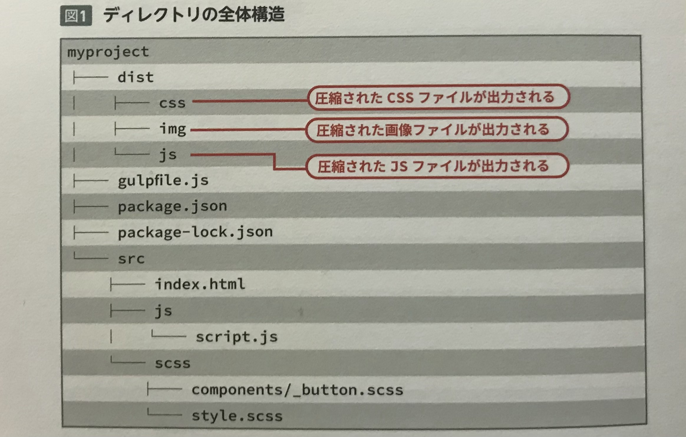

    Gulp にはさまざまなプラグインを追加できる。  
    普段から手動で行っている作業も Gulp を使って自動化することで、Webサイト制作の効率化や品質向上につながる。  

<br>

## Gulpを実行するディレクトリの準備
本節では、下記の Gulp のタスク設定をおこなっていく。  

* エラーのデスクトップ通知
* 複数のSCSSファイルの読み込み記述を簡略化する
* ベンダープレフィックスの自動付与を行う
* CSSの圧縮
* JavaScriptの圧縮
* 画像ファイルの圧縮
* ローカルサーバーを立ち上げ、ファイル更新時のオートリロードに対応



<br>
<br>
<br>

## エラーのデスクトップ通知
Gulp の `watch` を実行中にコンパイルなどのエラー出たとき、  
Gulp は**強制停止**し、コマンドラインツール上にメッセージが表示される。  

エラーのたびに停止するのは開発効率が悪く、さらにエラーはコマンドラインツールを見ていないと気づかないので、  
Gulp を強制終了させないための「**gulp-plumber**」と、  
デスクトップ通知を行う「**gulp-notify**」を追加する。  

<br>

まずは使用するモジュールをインストールする。  
```rb
$ npm install gulp-plumber gulp-notify --save-dev
```
次に、「gulpfile.js」でモジュールを読み込む。  
```rb
var plumber = require('gulp-plumber');
var notify = require('gulp-notify');
```
`on()` で記述していたエラーログの表示部分を書き換える。  
```
.on('error', sass.logError)
```
↓
```rb
.pipe(plumber({
    errorHandler: notify.onError('<%= error.message %>'),
}))
```
これで、SCSSファイル内で記述ミスがある場合は、  
エラーがデスクトップ通知されるようになった。  

<br>
<br>
<br>

## 複数のSCSSファイルの読み込み記述を簡略化する
１つのSCSSファイル内に、別のSCSSファイルを読み込むためには  
`@import` を使って、個別にファイル名を指定する必要がある。  
```
@import "components/1";
@import "components/2";
@import "components/3";
@import "project/1";
@import "project/2";
@import "project/3";
@import "utility/1";
@import "utility/2";
```
これだと**SCSSファイルが増えるたびに追加しなければならない**ため、非常に手間がかかる。  
「**gulp-sass-glob**」を利用すれば、ワイルドカードによって記述を省略できる。  
```rb
@import "components/**";
@import "project/**";
@import "utility/**";
```

<br>

まずは使用するモジュールをインストールする。  
```rb
$ npm install gulp-sass-glob --save-dev
```
次に、「gulpfile.js」でモジュールを読み込む。  
```rb
var sassGlob = require('gulp-sass-glob');
```
最後に、`cssTranspile()` のコンパイル設定の前に、プラグインの処理を追記する。  
```4D
.pipe(sassGlob())
.pipe(sass)())
```

<br>

これで、**ワイルドカードを利用したインポート記述が可能**となったので、「style.scss」の記述を変更する。  
```rb
@import "components/button";
@import "components/gradient";
@import "components/grid";
```
↓
```rb
@import "components/**";
```

<br>
<br>
<br>

## PostCSSで使用してCSSに処理を加える
「**PostCSS**」 は**生成されたCSSに対してさまざまな処理を加える**ことができる Node.js 製のツール。  

**Webブラウザごとのベンダープレフィックスを付与する**「**Autoprefixer**」、  
**CSSを圧縮する**「**cssnano**」、CSSリンターの「stylelint」などがある。  

> ここでは「Autoprefixer」と「cssnano」の導入をおこなう

<br>

まずは使用する「autoprefixer」「gulp-postcss」「cssnano」をインストールする。  
```rb
$ npm install autoprefixer gulp-postcss cssnano --save-dev
```
次に、「gulpfile.js」でモジュールを読み込む。  
```rb
var postcss = require('gulp-postcss');
var autoprefixer = require('autoprefixer');
var cssnano = require('cssnano');
```
`cssTranspile()` に処理を追記する。  
**PostCSS** はCSSに対して処理を行うため、Sass のコンパイル設定のあとに追加する。  
```4D
.pipe(sass())
.pipe(postcss([
    autoprefixer({
        grid: true,
    }),
    cssnano({
        autoprefixer: false,
    }),
]))
```
PostCSS はオプションでそれぞれのプラグインの設定を行うことができる。  
ここでは、**Autoprefixer** で `grid` にもベンダープレフィックスをつけるようにし、  
**cssnano** の Autoprefixer を削除する動作を無効化している。  

<br>
<br>
<br>

## JavaScriptの圧縮
JavaScriptを圧縮するには「**gulp-uglify**」を使用する。  

まずはモジュールのインストールを行う。  
```rb
$ npm install gulp-uglify --save-dev
```
次に、モジュールの読み込みをする。  
```rb
var uglify = require('gulp-uglify');
```
JavaScriptを圧縮するためのタスクを、新規に `jsTranspile()` という関数名で作成する。  
```4D
function jsTranspile() {
    return gulp.src('src/js/**/*.js')
        .pipe(plumber({
            errorHandler: notify.onError('<%= error.message %>'),
        }))
        .pipe(uglify())
        .pipe(gulp.dest('dist/js/'));
}
```
JavaScriptファイルの変更を監視し、変更があった場合に実行するように `watch` タスクに登録する。  
```4D
function watch(done) {
  gulp.watch(['src/js/*', 'src/js/**/*'], jsTranspile);
  done();
}
```

<br>
<br>
<br>

## 画像の圧縮を行う
画像を圧縮するには「**gulp-imagemin**」を使用し、  
**jpg、png、gif、svg** といった拡張子を対象に圧縮をかけるための、各種プラグインを追加する。  

まずは各モジュールをインストールする。  
```rb
$ npm install gulp-imagemin imagemin-jpegtran imagemin-pngquant --save-dev
```
次に、インストールしたモジュールを読み込む。  
```4D
var imagemin = require('gulp-imagemin');
var imageminJpegtran = require('imagemin-jpegtran');
var pngquant = require('imagemin-pngquant');
```
画像を圧縮するタスクを `imageMinify` という関数名で作成する。  
Gulp4 で実装された「**gulp.lastRun**」を利用することで、画像に変更があった場合のみ実行するようにする。  
```4D
function imageMinify() {
  return gulp.src('src/img/**/*', { since: gulp.lastRun(imageMinify) })
    .pipe(plumber({
      errorHandler: notify.onError('<%= error.message %>'),
    }))
    .pipe(imagemin([
      imagemin.gifsicle({
        optimizationLevel: 3,
      }),
      pngquant({
        quality: [ 0.65, 0.8 ], speed: 1
      }),
      imageminJpegtran({
        progressive: true,
      }),
      imagemin.svgo({
        plugins: [
          {
            removeViewBox: false,
          }
        ]
      })
    ]))
    .pipe(gulp.dest('dist/img/'));
}
```
画像ファイルの変更を監視し、変更があった場合は実行するように `watch` タスクに登録する。  
```4D
function watch(done) {
  gulp.watch(['src/img/*', 'src/img/**/*'], imageMinify);
}
```
これで画像を更新・追加した場合に圧縮が実行されるようになった。  
ただし、このままでは画像を **src** ディレクトリから削除した場合、  
**dist** ディレクトリに生成済みの画像を削除することができない。  

そのため、**一度 dist ディレクトリ内の画像を削除し、再圧縮するタスク**を作成する。  

<br>

まずはファイルやディレクトリを削除するモジュールを追加する。  
```rb
$ npm install del --save-dev
```
次に、del モジュールを読み込む。
```rb
var del = require('del');
```
削除を行う `cleanImage` 関数を作成する。  
```4D
function cleanImage() {
    return del(['dist/img/']);
}
```
`cleanImage` タスクを実行後に `imageMinify` タスクを実行するために、  
**exports に imagemin を登録し**、それぞれのタスクを **gulp.series** に設定する。  
```4D
exports.imagemin = gulp.series(cleanImage, imageMinify);
```
これで gulp コマンドで **imagemin** を実行できるようになった。  
```rb
$ npm gulp imagemin
```
このコマンドを実行すると、「dist」以下の「img」ディレクトリの画像が再圧縮され配置される。  

<br>

>  【参考】  
> [「gulp-imagemin」がエラーを吐いたとき、お世話になったサイト](https://crieit.net/posts/gulp-imagemin-become-pure-esm-package-20210817)


<br>
<br>
<br>

## Browsersyncを使ってブラウザのオートリロードを行う
**Browsersync** は、ファイルの監視を行い、更新された場合に自動でブラウザのリロードなどをおこなってくれるツール。  

>  【 **memo** 】  
> Browsersync を実行すると、**簡易的なローカルサーバー**が起動する。  
> 起動されたURLにアクセスすれば、PC、タブレット、モバイルで動作確認を行うことができ、複数の環境で操作の同期が可能となる。    

<br>

まずは Browsersync をインストールする。  
```rb
$ npm install browser-sync --save-dev
```
次に、gulpfile.js」で読み込む。  
```rb
var browserSync = require("browser-sync");
```
Browsersync のタスク設定を追記する。  
```4D
function server(done) {
    browserSync.init({
        server: {
            baseDir: 'src',
        },
    });
    done();
}
```

SCSSファイル、JSファイル、画像ファイルに更新があったら**ブラウザをオートリロード**する設定を各タスクに追記する。  
```4D
function cssTranspile() {
  return gulp.src('src/scss/**/*.scss')

    ~~~~~~ 省略 ~~~~~~

    .pipe(gulp.dest('dist/css/'))
    .pipe(browserSync.reload({ stream: true }));
}

function jsTranspile() {
  return gulp.src('src/js/**/*.js')

    ~~~~~~ 省略 ~~~~~~

    .pipe(gulp.dest('dist/js/'))
    .pipe(browserSync.reload({ stream: true }));
}

function imageMinify() {
  return gulp.src('src/img/**/*', { since: gulp.lastRun(imageMinify) })

    ~~~~~~ 省略 ~~~~~~

    .pipe(gulp.dest('dist/img/'))
    .pipe(browserSync.reload({ stream: true }));
}
```
また、gulp コマンド実行時に、Browsersync を定義した `server` タスクが実行されるようにする。  
```rb
exports.default = gulp.parallel(server, watch);
```

<br>
<br>
<br>

## その他のGulpプラグイン
このほかにもプラグインは数多く存在しており、  
HTMLの拡張メタ言語にあたる「pug」や「ejs」を変換するプラグイン、  
HTML・JS・CSS を自動で整形するもの、  
ScriptCSS を生成するプラグインなどもある。  

自分の制作するサイトによって最適化な Gulp 環境は異なるため、定期的にプラグインや設定環境を見直していこう。  

