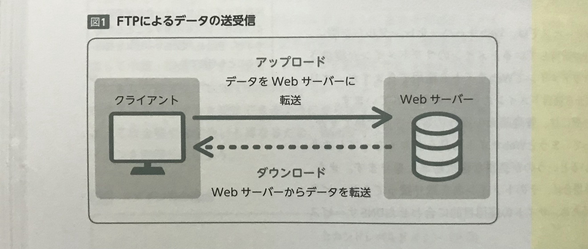
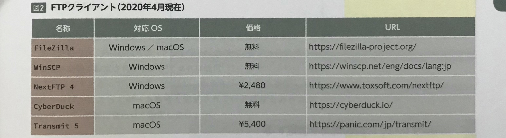

    Webサイトを公開するためには、Webサーバーにデータを転送する必要がある。  
    転送方法には、「GUIのFTPクライアントツールを使う方法」と「CUIでコマンドを使う方法」がある。  

<br>

## データをWebサーバーに転送する通信方法
**FTP（File Transfer Protocol)** とは、Webサーバーとクライアント間でデータを送受信する通信方法のこと。  
データをWebサーバーにアップロードするためには、FTPクライアントと呼ばれるアプリケーションを使用する。  



ホスティングサービスからWebサーバーを借りた場合は、サーバーアドレス（ホスト名）、ユーザ名、パスワードなどの接続情報が発行されるため、  
これらをFTPクライアントに設定することで、Webサーバーに接続が可能になる。  

ただし暗号化がされないため、第三者から情報を盗まれるセキュリティ的な問題がある。  
そのため、現在は SSL/TLS で保護した **FTPS** や、SSHを利用した **SFTP** といった通信方法が推奨されている。  

FTPS と SFTP が使えるかはホスティングサービスによって違いがあるため、より安全に公開・運用を行うためにも  
これらが使用できるサービスを選択するようにする。  

<br>
<br>
<br>

## FTPクライアントの種類
FTPクライアントは、無料で使えるものや有料で購入が必要なもの、  
Windows/macOS の両方で使えるものや、OS限定になるものなど様々に存在する。  
前述した FTPS や SFTP への対応、初期設定のしやすさや操作性など、実際に使用する際の利便性が大きく変わるため、  
無料のFTPクライアントだけでなく、有料のFTPクライアントも視野に入れて検討しよう。  



<br>
<br>
<br>

## Webサーバーの接続情報を設定する
FTPクライアントでWebサーバーに接続するには、基本的には次の接続情報を設定する。  

* ユーザー名
* パスワード
* プロトコル
* ホスト（サーバーアドレス）
* ポート番号

ユーザー名とパスワードに関しては、ホスティングサービス契約時に発行されるFTPのユーザー名とパスワードで設定する。  
**プロトコル**は、FTPクライアントで利用できる通信方法の種類を選択する。  
**ホスト**は、接続先のWebサーバーのホスト名を入力する。（ホスティングサービスによってはIPアドレスを指定されることもある）  
**ポート番号**は、FTP であれば通常「２１」、SFTP であれば「２２」がデフォルトになっている。  
ただし、**セキュリティ的な事情によりWebサーバーによってポート番号を変更されている場合もあるため**、  
Webサーバーごとに合わせて設定する。  

<br>
<br>
<br>

## SFTPにおける公開鍵認証
制作案件においては、FTP や FTPS でのアクセスが許可されておらず、かつ  
SFTP での接続時にパスワードを使用せずに、よりセキュリティ的に安全な**公開鍵認証**仕組みを使って接続する場合がある。  
公開鍵認証は、「**公開鍵**」と「**秘密鍵**」をユーザーのPCで作成し、  
「秘密鍵」はユーザーのPC上のみに保存、  
「公開鍵」をWebサーバーに設置することで接続できるようにする仕組みのこと。  

「公開鍵」は中身を誰かに見られたとしても「秘密鍵」がなければ接続できず、また「公開鍵」から「秘密鍵」を生成することもできない。  
そのため、**「秘密鍵」は他人に共有や公開しないことが原則になる**。  

<br>
<br>
<br>

## 鍵の作成
公開鍵認証の鍵を生成する方法としては、CUI上で「**ssh-keygen**」コマンドを使用して生成する方法がある。  
公開鍵と秘密鍵は、macOS の場合ホームディレクトリ以下の「**ssh**」ディレクトリに生成・保存する。  

<br>
<br>
<br>

## macOSで「.ssh」ディレクトリを作成する
macOS の場合は、ホームディレクトリ以下に「**.ssh**」ディレクトリがあるか確認し、なければ作成する。  
コマンドラインツールを起動し、mkdirコマンドを使って「.ssh」ディレクトリを作成する。  
```rb
$ mkdir .ssh
```
.sshディレクトリは、ユーザーのみ読み書きと実行ができるパーミッション権限に変更しておく必要がある。  
```rb
$ chmod 700 .ssh
```
これで鍵を保存する準備が整う。  

<br>
<br>
<br>

## macで鍵を作成する
macOS では、ターミナル上で「**ssh-keygen**」コマンドを使用して作成する。  
```rb
$ ssh-keygen -t rsa -b 2048 -C "あなたのメールアドレス"
```
実行後、鍵の保存先と名称についての確認が表示される。  
今回は変更を行わないため、「Enter」キーを押す。  
```rb
Enter file in which to save the key (/Users/saitoshu/.ssh/id_rsa):
```
次に、鍵を使用する際のパスフレーズの設定を求められる。  
設定することで、**鍵を使用する際にこのパスフレーズが必要となる**。  
任意の文字列を入力し、再確認でもう一度入力する。  
パスフレーズを設定しない場合は、そのまま「Enter」を2回押す。  
```rb
Enter passphrase (empty for no passphrase):
Enter same passphrase again:
```
↓
```4D
Your identification has been saved in /Users/saitoshu/.ssh/id_rsa.
Your public key has been saved in /Users/saitoshu/.ssh/id_rsa.pub.
The key fingerprint is:
SHA256:QeOrpuBcMfqDkuy7jrinmbdlB1ngoqRFCezDDRMvBsE mh61yoroyoro-03@yahoo.co.jp
The key's randomart image is:
```
上記の内容がターミナル上に表示されれば作成完了。  
「**id_rsa_pub**」が公開鍵となり、「**id_rsa**」が秘密鍵となる。  

<br>
<br>
<br>

## 公開鍵をWebサーバーに設定する
作成した公開鍵「id_rsa_pub」は、Webサーバーのユーザーディレクトリ以下の「**.ssh**」ディレクトリにアップロードし、  
名前を「**authorized_keys**」に変更して配置する。  

>  【 **POINT** 】  
> 複数の公開鍵を設定する場合は、「authorized_keys」を開いて、  
**すでに設定済みの公開鍵情報の次の行に設定したい公開鍵をコピー＆ペーストすることで**、  
> それぞれ設定した鍵でログインが可能。  

「.ssh」ディレクトリのパーミッションは、「**700**」に設定し、「authorized_keys」は「**600**」に設定する。  
これらの作業は自身でサーバー設定を行う場合を除いて、基本的にはサーバー担当者に公開鍵を送ることで接続設定を依頼する形となる。  

<br>
<br>