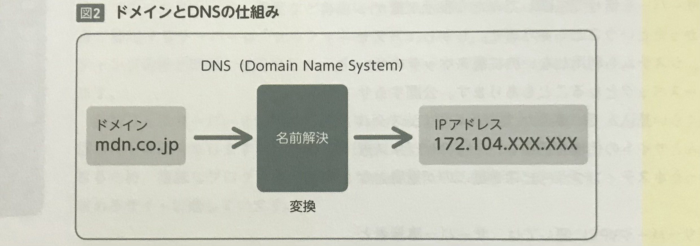

    Webサイトを公開するためには、  
    作成したデータやプログラムをWebサーバーに設置して、  
    ドメインを設定する必要がある。  
    ここではWebサーバーの種類とドメインについて解説する。  

 

## Webサーバーの特徴と種類
サーバーとは、「インターネット上からアクセスできる」ようにネットワーク設定をおこなったコンピュータ内に、  
公開するHTMLやCSS、画像データなどを設置しておき、**ブラウザのリクエストに応じて設置したデータを送信するソフトウェア**  
をインストールしたシステムのことをいう。  

ホスティング会社が提供するサーバーサービスには大きく分けて次の４種類がある。  

* 共有サーバー
* 専用サーバー
* VPS（Virtual Private Server）
* クラウドサーバー

どのサーバーを利用するかを、Webサイトの仕様に合わせて選択するために、それぞれの違いを理解する必要がある。  

 

#### 共有サーバー
**1台のサーバーを複数の利用者で共有して利用する**。  
利用者ごとに割り当てられた各ディレクトリ内へのファイルの追加、変更権限が与えられており、  
HTMLやCSSなどのデータを **FTP(S)** クライアントソフトを用いてアップロードする。  
サーバーのスペックやインストールされているソフトウェアは固定のため自由に変更はできないが、  
ホスティング会社が管理・保守をしてくれるため、**専門知識がなくても利用できる**。  

また、月額費用は数百円から数千円程度で**非常にコストを抑えることができるので**、  
個人利用からコーポレートサイトなど中小規模のサイトに適している。  
ただし、1台のサーバーを共有で利用するため、**他ユーザーの負荷を受けやすく**、サイトの表示が遅くなることもある。  

 

#### 専用サーバー
**1台のサーバーを１人で専用できるサーバーのこと**。  
共有サーバーとは違い、回線やハードウェア資源を独占して利用できるため、ほかの利用者の影響を受けることなく、  
OSからソフトウェアのインストール、設定など自由に行うことができる。  

利用者自身で管理するサーバーは「**セルフマネージドサーバー**」と呼ばれ、  
ホスティング会社が構築・運用するサーバーを「**マネージドサーバー**」という。  
契約ごとにサーバーを物理的に用意するため、**初期構築費と月額の管理コストは高くなるが、サイトに合わせたサーバーを用意できるため**、  
複雑なプログラムや大規模なWebサイトなど運用に安定性を求めるサイトに適している。  

 

#### VPS
仮想化技術により**1台のサーバー内で複数の仮想サーバーを構築し、そのうちの１つの仮想サーバーを利用者へ提供する仕組み**のサーバー。  
利用者は管理者権限を与えられているため、仮想サーバー内の**OSのセットアップからソフトウェアの導入・カスタマイズまで自由に**行うことができ、**月額1,000円〜と専用サーバーに比べて安価に**利用できる。  

ただし、サーバーの初期設定から運用に関しては利用者自身で行う必要があるため、**専門的な知識が必要となる**。  
また、メモリやCPU、ハードディスクの容量などは契約時のスペック固定となるため、**利用者が自由にスケールアップやスケールダウンできない**。  
Webサイトのアクセスが安定している中小規模のサイトにおいて、CMC など設置するシステムにサーバー仕様を合わせる場合などに適している。  

 

#### クラウドサーバー
仮想化技術により、1台のサーバー内で複数の仮想サーバーを構築できる。  
**VPS との違いは、利用者が仮想サーバーの構築を自由に行えることと、アクセスに応じてスペックのスケールアップ・スケールダウンを行えること**。  
そのため、専用サーバーや VPS のようにスペックが固定されず、Webサイトの成長や運用に合わせて柔軟にサーバー設計を行うことができる。  

また、**料金も従量課金製のため、基本的には使った分だけの請求となる**。  
ただし、アクセス数が持続的に多く、大容量の動画や画像ファイルなどの配信を行なった場合は、それに応じて月額コストも高くなるため、  
構築するサイトに合わせて**事前にいくらかかるか試算しておこう**。  

 
 
 

## Webサーバーの選び方
Webサーバーは通常のコンピュータと同様、基本的にはスペックが高ければ、処理が高速となり大人数のアクセスにも耐えられるようになる。  
**安価な共用サーバーを借りて公開してみたら表示が重かった、プログラムが動かなかった**ということもある。  
しかし、アクセス数がそこまで多くなく、システムも利用しないのに高スペックのサーバーを用意しても**オーバースペック**となることもある。  

自由度の高いクラウドサーバーや VPS に関しては、サーバー事業者と同様の知識と経験が必要となる。  
例えば、**インストール済みのソフトウェアのアップデート、セキュリティパッチの適応や不正アクセス対策、監視体制、障害発生時の対応、  
サーバーのバックアップ**といった日々の管理・運用作業が重要となる。  
クライアント案件などで**脆弱性があった場合は、顧客のデータ流出にもなりかねない**。  
サーバーの初期構築はもちろん、運用時についてもしっかりとした体制づくりをしよう。  

 

## ドメインについて
住所に重複するものがないのと同じで、ドメインも世界中で重複しないように、組織的に管理されている。  

インターネットに接続されているサーバーは、その機器が**ネットワーク上のどこにあるか**を識別するために、  
「172.104.XXX.XXX」といった数字で構成された「**IPアドレス**」がそれぞれに割り当てられている。  

ドメイン名とIPアドレスを紐付け、**ドメインでアクセスした際にIPアドレスへ変換する仕組み**を「**名前解決**」といい、  
これを管理するシステムを「**DNS（Domain Name System)**」という。  

 

>  【 **memo** 】  
> コンピュータはIPアドレスをもとに通信を行うが、数字だけのアドレスを人間が識別するのはわかりにくいため、  
> **英数字や日本語に変換したドメイン名**が使用されている。  

 

また、ドメイン名とIPアドレスを紐付けした情報を保存しているデータベースサーバーを「**DNSサーバー**」といい、  
ユーザーはこれらを取り扱うDNSサービス会社と契約することで、  
**ドメインの取得**および、**ドメインとWebサーバーの設定**が可能となる。  

 
 
 

## ドメイン名の種類
ドメイン名は「 . 」区切りの**ラベル**で構成されており、ホスト名や組織、国名をラベル別に識別できる。  
ドメイン名の末尾のラベルを**トップレベルドメイン（TLD）**、  
以降、左へ順に**セカンドレベルドメイン（SLD）**、**サードレベルドメイン**という。  
> > > 

 

ユーザーがドメインを取得する際には、サードレベルドメインに当たる**組織のドメイン名**を自分で決め、  
**TLD と SLD に空きがあるかをドメイン管理会社で検索して申請・取得をする**。  

また、ドメインを取得すると「**www**」（ホスト名）にあたる部分に、**ドメイン内を分類化するサブドメインを設定できるようになる**。  
ドメイン名によって金額も意味合いも異なるので、Webサイトの内容に合わせたドメインを取得しよう。  

>  【 **memo** 】
> TLD には、汎用的な用途に応じた **gTLD** の「.com/.net/.org/.info」や、  
> 国名や地域コードを表した **ccTLD** の「.jp/.uk/.fr」などがある。  
> gTLD は誰でも取得できるが、ccTLD はその国や地域に住所がなければ取得できない。  

 

 
 
 
