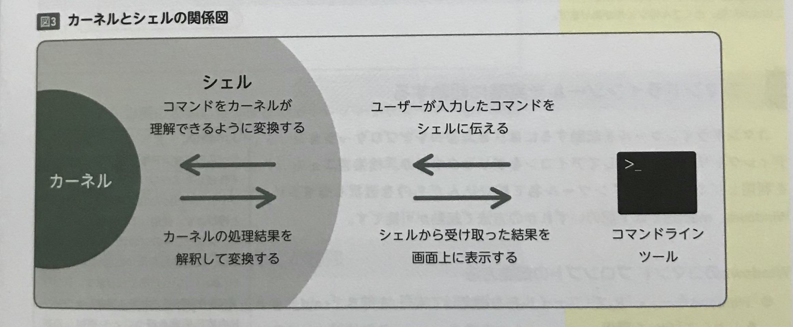
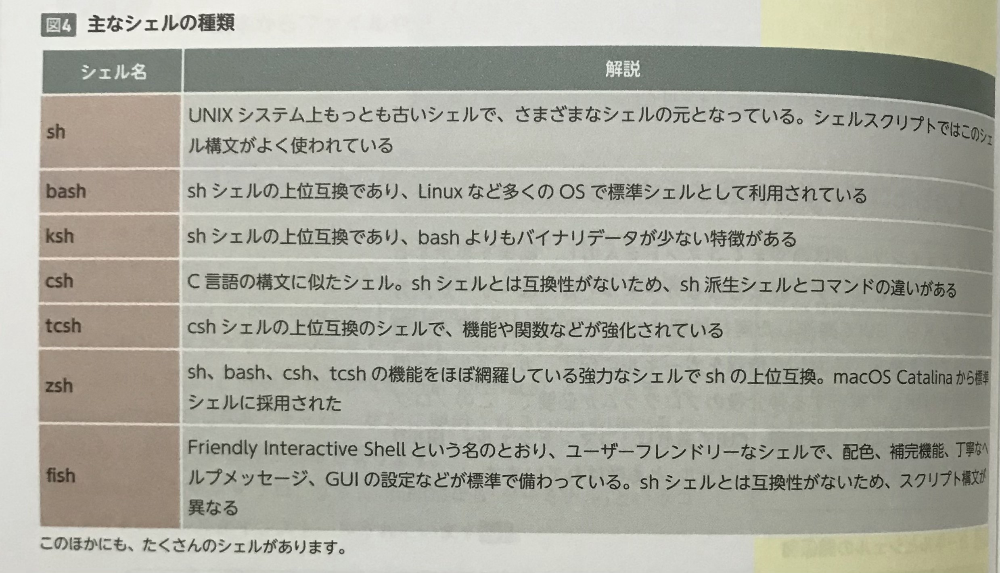
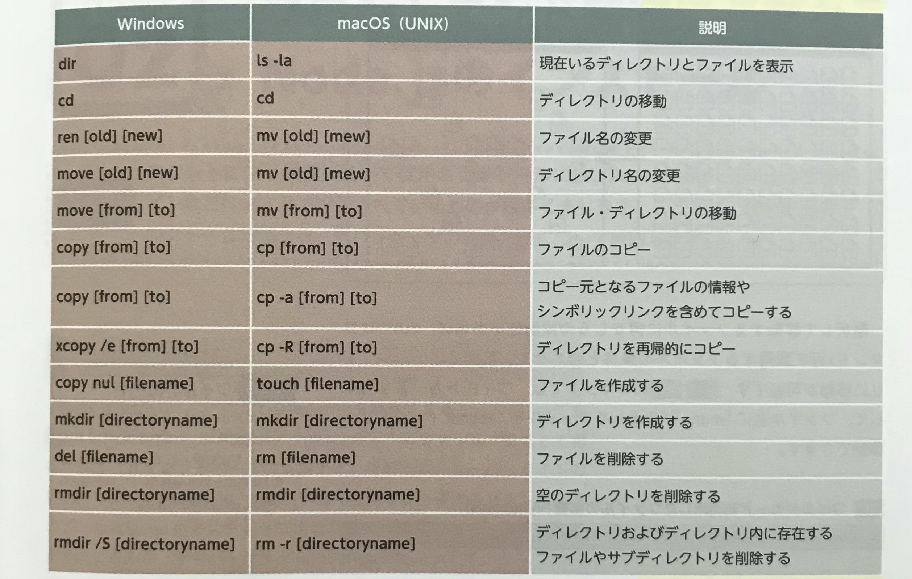

## 機能が強化されたコマンドラインツール
デフォルトでインストールされているコマンドラインツールは、そのままでは少し扱いにくい場合がある。  

カスタマイズで自分好みに設定することも可能だが、最初から色々なツールのいいとこ取りをした**上位互換のツール**も存在する。  

「コマンド画面をタブ化して１ウィンドウにまとめる」「ローカルとリモートサーバーの表示を画面分割する」「配色をカスタマイズする」、というように、デフォルトよりも豊富な機能を搭載している。  

Windows であれば「**PowerShell**」や「**RLogin**」、  
macOS なら「**iTerm2**」があるので、デフォルトのツールで不便を感じるようなら導入をおすすめする。  

<br><br>

## 入力したコマンドを実行する仕組み
コマンドラインツールは**あくまでコマンドを入力し、結果を表示するツール**である。  

コンピュータの核となるカーネルでは、ユーザーが入力したコマンドや、GUIで操作した実行処理について直接的に解釈する機能を持っていない。  

**入力した情報をカーネルに伝え、カーネルからの処理結果を解釈して実行する仲介役**を「**シェル**」という。  

CUIであれば「**コマンドシェル**」、  
GUIの仲介をするシェルは「**グラフィカルシェル**」とも呼ばれている。  

<br>



シェルにはざまざまな種類がある。  
Windows や macOS でコマンド文が違うのは、OSによって設定されているシェルが異なるため。  

<br>



<br><br>

## よく使う基本的なコマンド一覧




[【Linuxコマンド集INDEX】](https://xtech.nikkei.com/it/article/COLUMN/20060224/230573/)

<br>
<br>

## CUIを使った効率的なファイル操作
ここまで紹介してきたコマンドに関しては、GUIでも実行できる。  
しかし、GUIは画面上でわかりやすく操作できる反面、ファイル数やファイル容量が大きくなると、CUIに比べて遅くなってしまうことがある。  

例えば、大量のファイルの中から「**ファイル名に特定の単語を含むファイルを選択して移動させる**」場合、  
CUIでは**コマンド１行**で移動先のディレクトリに移すことができる。  

下のコマンドでは、" **ワイルドカード** "を利用して、ファイル名に「`mdn`」が含まれるファイルを、mdnディレクトリへ移動できる。  

```
$ mv *mdn* ./mdn/
```

<br>

>  【ワイルドカード】  
> ワイルドカードは、不特定の文字列を表す特殊記号で、文字列やファイルを検索においてよく使われている  
> 「？」は任意の１文字に一致するして、「*」は任意の０文字以上の文字列を表す  

<br>
<br>

## フロントエンド開発でのCUIの利用
以前のWeb制作では、CUIはインフラやバックエンドを担当するエンジニアが使っており、  
HTML＋CSS＋JavaScript をコーディングするだけでは、使う機会は多くなかった。  

しかし、**Sass** をはじめとした**CSSメタ言語**の登場によるコンパイル作業やタスクランナーの登場によって、  
CUIを使ったインストール方法や実行方法が紹介され、フロントエンドでも使用する機会が増えた。  

もちろんGUIを使った方法もあり、**Git** であれば、GUIを使うことで視覚的にログや差分を追いやすいだろう。  

GUI、CUIどちらにも利点や欠点はあるものの、どちらか一方だけを使うのではなく、**自分の開発スタイルに合わせて**柔軟に使い分けできるようにする。  
